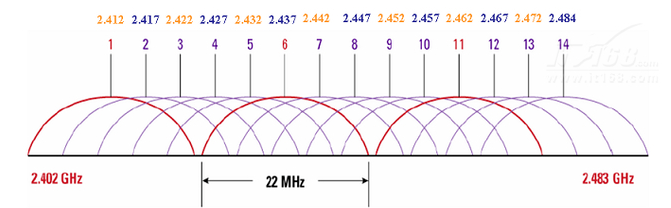
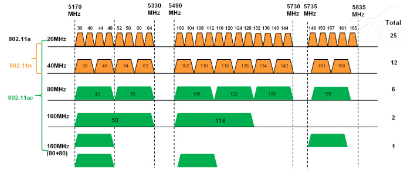

## 802.11 基本

### 协议

|协议    |频率         |信号        |最大传输速率|
|-       |-           |-           |-          |
|802.11	 |2.4Ghz	  |FHSS 或 DSSS|2Mps       |
|802.11a |5GHz	      |OFDM	       |54Mps      |
|802.11b |2.4GHz	  |HR-DSSS	   |11Mps      |
|802.11g |2.4GHz	  |OFDM	       |54Mps      |
|802.11n |2.4GHz或5GHz|OFDM	       |540Mps     |
|802.11ac|2.4GHz或5GHz|		       |400M 2.4GHz，900M 5GHz|

* 802.11b和802.11g工作在同一频段上，g能够兼容b，也就是说支持g的网卡都能支持b

* 802.11n协议为双频工作模式，保障了与以往的802.11a b, g标准兼容

* 新一代标准802.11 ac是从802.11 n上发展而来的，每个通道的工作频宽20/40MHz提高到了80/160MHz，故有着比802.11 n更高的速度

### 信道

* 2.4GHz 共有14个信道，国内可用1-13信道，不干扰的仅**1、6、11**

    

* 对于5GHz，11.n协议一共有37个信道，11.ac一共有37+9个信道，国内室内AP可用**36, 40, 44, 48, 52, 56, 60, 64, 149,153, 157, 161, 165这13个信道**
    

* 一个普通信道是20M带宽，可复用一个信道达到40M带宽

### omnipeek抓包信道

* bgn：b、g、n协议
* an：a、n协议
* n40l：n协议下40Mhz带宽的向下复用信道
* n40h：n协议下40Mhz带宽的向上复用信道
* u：ac协议下，当设置5G信道为80M带宽时，用u1,u2,u3来代表80M带宽的前中后

## 802.11 帧格式

### 帧类型

* 第一个字节的B3B2：00-管理帧，01-控制帧，10-数据帧

* 管理帧：
    * **Probe帧（Probe Request/Response Frame）**：STA可以发送Probe Request来主动探测周围有哪些802.11网络，接收到AP需回应Probe Response（包含beacon封包的各种参数）
    * **认证帧（Authentication Frame）**
    * **连接请求帧（Association Request/Response Frame）**
    * **Action帧**
    * **信标帧（Beacon Frame）**：周期性宣告802.11网络存在，以及支持的各类无线参数，如ssid、速率、认证类型、缓存帧的STA列表等。
    * 解除认证帧（Deauthentication Frame）
    * 解除连接帧（Disassociation Frame）
    * 重新连接请求帧（Reassociation Request Frame）
    * 重新连接响应帧（Reassociation Response Frame）

* 数据帧：主要负责传输数据报文。主要定义了两种数据帧
    * Data：真正的数据报文，所有802.11数据报文的载体。
    * NULL：只有802.11 MAC header和FCS 尾；

* 控制帧：用来协助数据帧的发送
    * RTS/CTS :负责无线信道的清空，取得媒介的控制权。
    * PS-Poll：sta从省电模式醒来，可发送PS-Poll帧，从AP获取缓存帧。
    * ACK：接收端收到报文后，需要回应ACK帧向发送端确认收到报文。
    * Block AckRequest/Block ACK:802.11n中，为提升MAC层效率，使用Block ACK机制对一批数据帧一次性的确认。
    * CF END
    * CF ACK

## WIFI建立过程

### 1. 设备探测

STA -> ?: Probe Req
AP -> STA: Probe Rsp

### 2. 链路认证

STA -> AP: Auth Req
AP -> STA: Auth Rsp

### 3. 关联

STA -> AP: Assoc Req
AP -> STA: Assoc Rsp

### 4. 接入认证

4次握手秘钥交换：

AP->STA: QoS Data(EAPOL Key1(ANonce))
STA->AP: QoS Data(EAPOL Key2(SNonce、MIC))  # STA计算出PTK
AP->STA: QoS Data(EAPOL Key3(GTK、MIC))     # AP用PTK加密GTK
STA->AP: QoS Data(EAPOL Key4)               # STA解密成功后安装PTK/GTK

### 5. ADDBA协定Block Ack*

通过ADDBA 启用Block Ack协定; 通过DELBA 撤消Block Ack协定

AP->STA: Action(ADDBA Req)
STA->AP: Action(ADDBA Rsp)

STA->AP: Action(ADDBA Req)
AP->STA: Action(ADDBA Rsp)

### 6. QoS Data和Block Ack*

用于一次性ACK多个之前的数据包

Sender -> Receiver: QoS Data * n
Sender -> Receiver: Block Ack Req  # 未观察到
Receiver -> Sender: Block Ack

## WIFI Direct(P2P)首次建立过程

### 1. Device Discovery

* 基本流程
    * Source -> 广播: Probe Req
    * Sink -> Source: Probe Rsp

* 两个状态
    * Search State：P2P Device将在多个Social频段上分别发送Probe Request帧（含P2P IE）
    * Listen State：P2P Device将随机选择在一个Social频段上监听（含P2P IE的）Probe Request帧并回复Probe Response帧

* 两个阶段
    * Scan Phase：和Search State行为一致；这一阶段中不会处理来自其他设备的Probe Request帧；然后P2P Device将进入下一个阶段
    * Find Phase：P2P Device将在Search State和ListenState之间来回切换

### 2. Provison Discovery

确定交互双方使用的WSC方法，用于GO协商

* Source -> Sink: Action(Provison Discovery Req)
* Sink -> Source: Action(Provison Discovery Rsp)

### 3. GO Negotiation

* Source -> Sink: Action(GO Negotiation Req)
* Sink -> Source: Action(GO Negotiation Rsp)  # sink端用户确认后
* Source -> Sink: Action(GO Negotiation Confirmation)

### 4. Auth

* GC -> GO: Auth Req
* GO -> GC: Auth Rsp

### 5. Association

* GC -> GO: Assoc Req
* GO -> GC: Assoc Rsp

### 6. EAPOL

全称Extensible Authentication Protocol Over LAN，即EAP Over Lan，4次握手秘钥交换

GC->GO: QoS Data(EAPOL Key)
GO->GC: QoS Data(EAPOL Key)
GC->GO: QoS Data(EAPOL Key)
GO->GC: QoS Data(EAPOL Key)

### 7. 断开

Source -> Sink: Deauth      # 解除认证
Source -> ?: Disassoc       # 解除关联

## WIFI Direct(P2P)邀请加入连接

### 2. P2P邀请

Source -> Sink: Action(P2P Inviation Req)
Sink -> Source: Action(P2P Inviation Rsp)