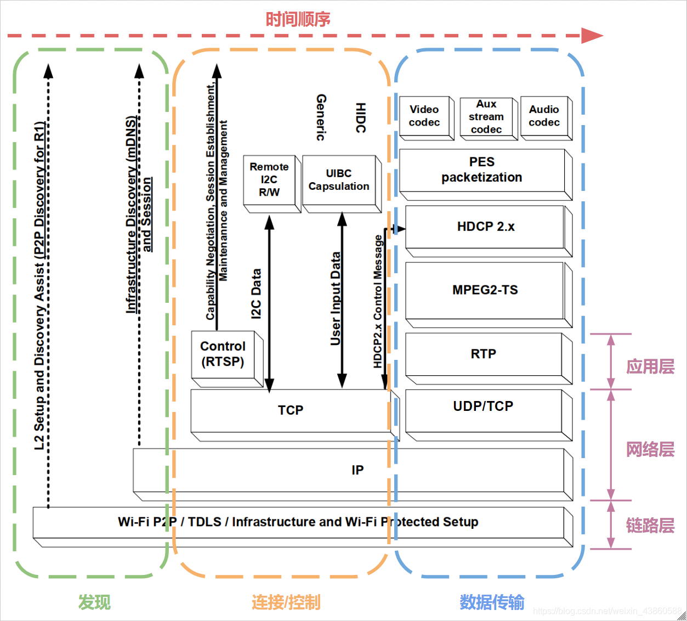
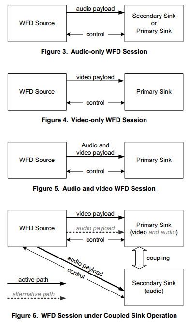
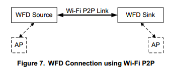
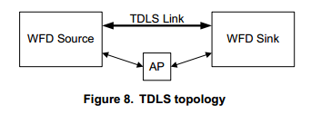
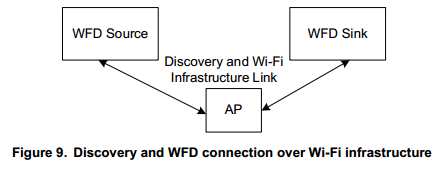
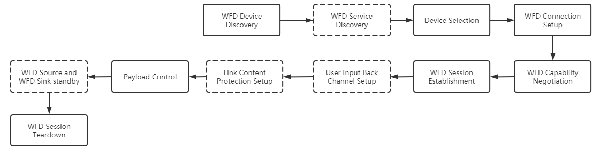
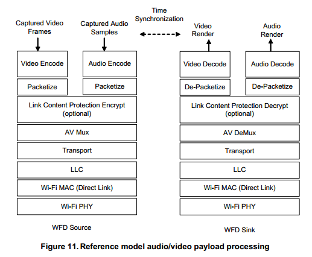

<!-- TOC -->

- [简介](#%E7%AE%80%E4%BB%8B)
    - [架构图](#%E6%9E%B6%E6%9E%84%E5%9B%BE)
    - [两种角色](#%E4%B8%A4%E7%A7%8D%E8%A7%92%E8%89%B2)
    - [四种Session模型](#%E5%9B%9B%E7%A7%8Dsession%E6%A8%A1%E5%9E%8B)
    - [三种Connection拓扑](#%E4%B8%89%E7%A7%8Dconnection%E6%8B%93%E6%89%91)
    - [协定的方法和服务](#%E5%8D%8F%E5%AE%9A%E7%9A%84%E6%96%B9%E6%B3%95%E5%92%8C%E6%9C%8D%E5%8A%A1)
        - [认证](#%E8%AE%A4%E8%AF%81)
        - [方法清单](#%E6%96%B9%E6%B3%95%E6%B8%85%E5%8D%95)
    - [十一个步骤](#%E5%8D%81%E4%B8%80%E4%B8%AA%E6%AD%A5%E9%AA%A4)
- [WDF Android](#wdf-android)

<!-- /TOC -->

## 简介

### 架构图

### 两种角色

* Source：数据源，投屏端(手机、PC)，
* Sink：接收端，被投端（TV盒子）
    * Primary Sink端
    * Secondary Sink端 只可以接收音频数据，适用于分体音箱设备

### 四种Session模型

### 三种Connection拓扑

* R1版的WFD可以建立在WiFi-P2P或者TDLS(Tunneled Direct Link Setup)的基础上
* R2版的WFD可以建立在WiFi-P2P或者WiFi-Infrastructure的基础上
* R2版WiFi-Infrastructure是在R1版的TDLS一定程度的简化

* WiFi-P2P
    
    
    
    * 上图AP可以不存在，也可以存在，可以同一个，也可以不同
    * 当只有一个Sink时，Sink和Source都可以作为GO
    * 当有2个Sink时，只有Source可以作为GO

* TDLS
    
    

* WiFi-Infrastructure
    
    

### 协定的方法和服务

#### 认证

* WFD Device需要包含如下认证：
    * 802.11n Certification
    * Wi-Fi Protected Setup Certification
    * Wi-Fi Direct Certification

* TDLS WFD Device：
    * Wi-Fi TDLS Certification

* R2 Wi-Fi-P2P Device(over 11ac):
    * 802.11ac certification

#### 方法清单

* WFD R1 Device在一个session中只能扮演一种角色，但可以同时在不同session扮演不同角色
* R2 Device可以在一个session中同时扮演两个角色
* R1简化版清单如下(M-强制的，O-可选的)，详细查看<Wi-Fi_Display_Technical_Specification_v2.1_0>

    |Functions and Services|Source|Sink|
    |-|-|-|
    |Device Discovery(s4.3)|M|M|
    |Capability negotiation (s4.6)|M|M|
    |Connection Setup(s4.5.2)|M|M|
    |Session establishment(s4.8)|M|M|
    |...|-|-|

### 十一个步骤

* **WFD Device Discovery**: Source/Sink设备发现对方设备；
    * 如果R2的Source/Sink已经连接到Wi-Fi infrastructure网络或者已经建立P2P链接，那么他们将通过mDNS或DNS-SD发现对方
    * 当WFD Device 充当WiFi-P2P的Group Owner时在其发出的Beacon中追加WFD IE
    * 当WFD Device 充当Station模式时在其发出的Probe Request和其Probe Response中追加WFD IE
    * TDLS在设备发出的tunneled Probe Request/Response中附加WFD IE
    * Infrstruct BSS： 略
    * WFD IE里面包含一些WFD设备信息

* ***WFD Service Discovery***: 可选步骤；进一步发现对方的服务能力

* **Device Selection**: 选择需要链接的设备；可以根据策略自动选择，也可以用户手动选择；

* **WFD Connection Setup**: 选择Wi-Fi P2P/TDLS/infrastructure中一个作为建立链接的方法；
    * WFD Source充当TCP Server；WFD Sink充当TCP Client
    * Port默认为7236或者指定为49152~65535之间的一个
    * 可以建立WPA2安全的单跳链接

* **WFD Capability Negotiation**: 包含一系列的RTSP消息交换，用以确定双方的音视频能力

* **WFD Session Establishment**: 建立WFD Session；Source根据Sink的能力选择合适的音视频参数并通知Sink，

* ***User Input Back Channel Setup***: 可选步骤；在Source和Sink之间建立通信通道，用于传输Sink端用户发送的control、data信息

* ***Link Content Protection Setup***: 链接内容保护；可选步骤；略

* **Payload Control**: 以上步骤完成后，就开始payload传输；在session期间，允许被控制

* **WFD Source and WFD Sink standby**: Source和Sink备选，可选；在Session期间，允许Source和Sink管理和控制电源模式，例如备用和恢复操作

* **WFD Session Teardown**: 关闭Session

* 音视频流模型

## WDF Android

* Android 4.2开始集成miracast，4.4正式使用，但到6.0被丢弃，因为为了推广google cast
    * 4.2中新增wfd源码（包括sink和source），4.3移除sink，路径：frameworks/av/media/libstagefright/wifi-display [源码](https://android.googlesource.com/platform/frameworks/av/+/refs/tags/android-4.2.2_r1.2/media/libstagefright/wifi-display)
    * android 9.0直接移除了整个wifi display源码

* Android 支持WiFI Direct，需要设备厂商实现对于HAL接口：`hardware/interfaces/wifi/1.3` 或更高版本 和`hardware/interfaces/wifi/supplicant/1.2` 或更高版本
    * [AOSP WLAN 直连](https://source.android.com/devices/tech/connect/wifi-direct)
    * VT6105并没有实现上述接口

* Android WIFI direct连接流程：
    * 一般情况：WifiP2pSettings界面触发搜索和链接
    * 若无WifiP2pSettings界面，可以(通过反射)代码控制。[官方演示](https://developer.android.com/training/connect-devices-wirelessly/nsd-wifi-direct)
    * 前提都是设备厂商实现了wpa_supplicant接口
    * [WiFi Direct详解](https://blog.csdn.net/qq_43804080/article/details/92133306?utm_medium=distribute.pc_relevant.none-task-blog-2%7Edefault%7EBlogCommendFromMachineLearnPai2%7Edefault-8.withoutpai&depth_1-utm_source=distribute.pc_relevant.none-task-blog-2%7Edefault%7EBlogCommendFromMachineLearnPai2%7Edefault-8.withoutpai)