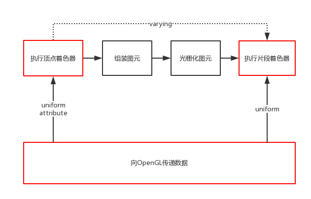
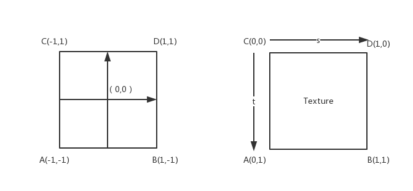
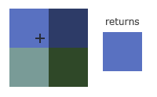
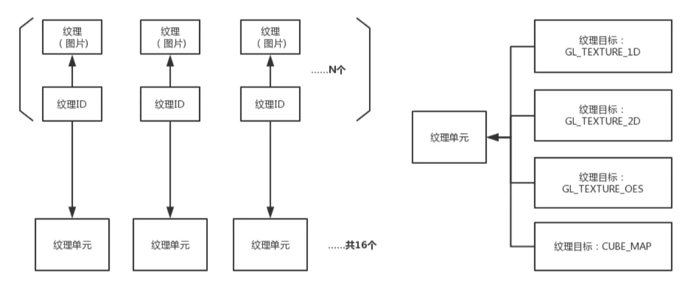

## 基础

* OpenGL ES开发三个重点：vertex shader，fragment shader和数据传递

    

    * 数据传递典型示例：[渐变色](https://www.jianshu.com/p/6220228b822b)，流程：（顶点的位置(attribute)、颜色(attribute) → 顶点着色器 → 光栅化：计算出每个片段的具体颜色值 → 片段着色器）;代码：LearnOpenGL/com/example/learnopengl/test/colorful/ColorfulRenderer.java

        1. 顶点着色器: 示例里传递给顶点着色器的数据包含了每个顶点的位置、颜色；每个顶点都执行一次，比如我们绘制一个线段，包含了2个顶点，那么就是执行2次顶点着色器。

        2. 组装图元：将顶点连接，根据需求绘制顶点、线段、三角形，本次案例是线段。

        3. 光栅化图元：关键！ 在光栅化图元的时候，将两个顶点之间的线段分解成大量的小片段，varying数据在这个过程中计算生成，记录在每个片段中(而不是从顶点着色器直接传递给片段着色器)。

        4. 片段着色器：每个片段都计算一次，假如是线段中间的片段，那么传递过来的varying值是紫色的。

* 简单几何图形的绘制：LearnOpenGL/com/example/learnopengl/test/hello/HelloRenderer.java

* 通过正交投影矩阵，可以将标准设备坐标转换成实际设备坐标：[正交投影](https://www.jianshu.com/p/51a405bc52ed)

## 纹理绘制(采样)

### 基本

* 光栅化过程中，将图形处理成一个个小片段，然后可以执行纹理绘制(采样)：计算出当前片段在纹理上的坐标位置，然后在片段着色器的中，根据这个纹理上的坐标，去纹理中取出相应的颜色值

    * 渐变色：光栅化过程中，计算出颜色值，然后在片段着色器的时候可以直接赋值

### 纹理坐标



* 上左图为：顶点坐标系
* 上右图为：纹理坐标系，叫做ST纹理坐标，又叫UV坐标，和**屏幕坐标系**类似
* 纹理映射时，四个顶点在两个坐标系中的顺序需要一致，即一一对应

### 纹理加载

* OpenGL ES 2.0中规定，纹理的每个维度必须是2次幂，也就是2、4、8 ... 128、256、512...
    
    * 纹理大小最大值不同设备各不相同，可以通过GL方法查询：`GLES20.glGetIntegerv(GLES20.GL_MAX_TEXTURE_SIZE, maxTextureSize, 0);`

* OpenGL只能直接加载Bitmap这种原始数据为纹理
    
    * 若为jpg或png之类的编码图片，可以通过BtimapFactory解码读取图片，但要设置为非缩放的方式，即options.isScaled = false

    * 且内置图片应放到drawable-nodpi目录下，避免被压缩处理

### 纹理过滤

* 若纹理元素和小片段无法一一对应，会出现纹理的压缩或者放大，这时就需要**纹理过滤**，详细可参见[纹理过滤@LearnOpenGL-CN](https://learnopengl-cn.readthedocs.io/zh/latest/01%20Getting%20started/06%20Textures/#_3)；

* GL的有些方法会需要传入纹理过滤方法，常用的方法有：

    * GL_NEAREST（也叫邻近过滤，Nearest Neighbor Filtering）是OpenGL默认的纹理过滤方式。当设置为GL_NEAREST的时候，OpenGL会选择中心点最接近纹理坐标的那个像素。下图中你可以看到四个像素，加号代表纹理坐标。左上角那个纹理像素的中心距离纹理坐标最近，所以它会被选择为样本颜色：
        

    * GL_LINEAR（也叫线性过滤，(Bi)linear Filtering）它会基于纹理坐标附近的纹理像素，计算出一个插值，近似出这些纹理像素之间的颜色。一个纹理像素的中心距离纹理坐标越近，那么这个纹理像素的颜色对最终的样本颜色的贡献越大。下图中你可以看到返回的颜色是邻近像素的混合色：
        

    * GL_NEAREST产生了颗粒、锯齿和高锐度，而GL_LINEAR更平滑、模糊即低锐度
        

    * 需要根据场景和喜好选择过滤效果，比如在纹理被缩小的时候使用GL_NEAREST，被放大时使用GL_LINEAR，代码如下：
        ```JAVA
        glTexParameteri(GL_TEXTURE_2D, GL_TEXTURE_MIN_FILTER, GL_NEAREST);
        glTexParameteri(GL_TEXTURE_2D, GL_TEXTURE_MAG_FILTER, GL_LINEAR);
        ```

### 纹理/纹理ID/纹理单元/纹理目标



* 纹理：在OpenGL中简单理解就是一张图片
* 纹理Id：纹理的直接引用
* 纹理单元：纹理的操作容器，有GL_TEXTURE0、GL_TEXTURE1、GL_TEXTURE2等，纹理单元的数量是有限的，最多16个。所以在最多只能同时操作16个纹理。在切换使用纹理单元的时候，使用`glActiveTexture`方法。
* 纹理目标：一个纹理单元中包含了多个类型的纹理目标，有GL_TEXTURE_1D、GL_TEXTURE_2D、CUBE_MAP等。
* 比如，加载纹理到指定纹理ID后，将纹理ID绑定到纹理单元0的GL_TEXTURE_2D纹理目标上，之后对纹理目标的操作都是对纹理Id对应的数据进行操作。

### 示例

* com/example/learnopengl/test/render/Texture1Renderer.java

* 调试：可以通过com/example/learnopengl/util/DumpHelper.java的sendImage将绘制的一帧数据dump到图片
