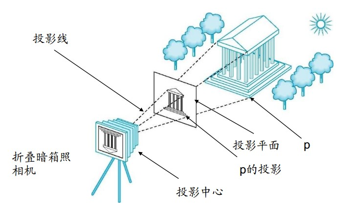
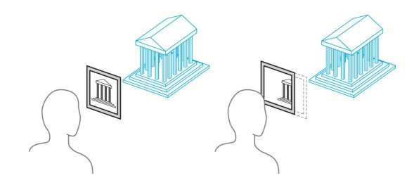
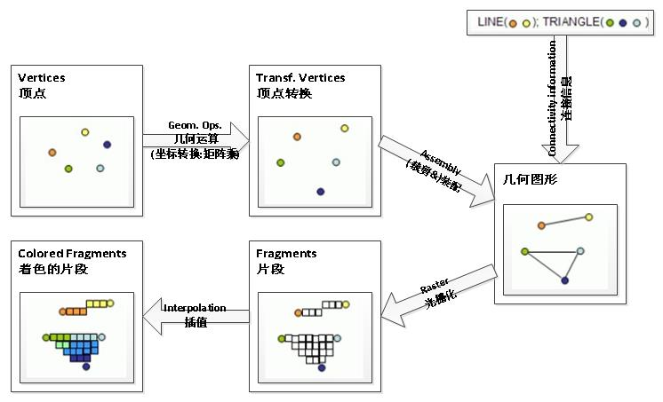

<!-- TOC -->

- [学习资料](#%E5%AD%A6%E4%B9%A0%E8%B5%84%E6%96%99)
- [术语](#%E6%9C%AF%E8%AF%AD)
- [三个阶段](#%E4%B8%89%E4%B8%AA%E9%98%B6%E6%AE%B5)
- [成像模型](#%E6%88%90%E5%83%8F%E6%A8%A1%E5%9E%8B)
- [图像渲染管线pipeline](#%E5%9B%BE%E5%83%8F%E6%B8%B2%E6%9F%93%E7%AE%A1%E7%BA%BFpipeline)

<!-- /TOC -->

# 学习资料

* [黄章进的教材:计算机图形学](http://staff.ustc.edu.cn/~zhuang/cgi/)

# 术语

* 图形(graphics)，具有几何要素(形状、点、线、面、体等)和其他要素(颜色、材质、纹理、线型、线宽等)的图形对象；（参数法）

* 图像(image)，通过枚举出所有点(像素)的颜色、亮度值来展示图形的方法；（点阵法）

* 帧缓冲区（frame buffer），存储屏幕上像素的颜色信息
    * 位图(bitmap)，每像素一位的帧缓冲区
    * 像素图(pixmap)，每像素多位的帧缓冲区

* 插值(interpolation)，*给fragment中的像素着色？*

* 着色器(shader)，分顶点着色器和片段着色器；还有geometry shaders和compute shaders

* 光栅（Raster），像素的阵列

* 光栅化（Rasterization），将图形信息转化为用像素描述的图像的过程。具体参见《学习资料-图形学光栅化详解》

# 三个阶段

* 建模（modeling），用数学模型来描述图形各属性

* 处理（processing），用数学变化（几何变换、投影变换）、运算（集合运算）、着色、形变来处理图形

* 渲染（rendering），将图形转换为图像并显示出来

# 成像模型

* 虚拟照相机模型（OpenGL和Direct3D）：观察对象、观察者、光源

    * 通过例如OpenGL的API，指定对象、材料属性、光源、观察者，模型框架实现确定最终的图像
    
    

* 裁剪矩形(clipping rectangle)或裁剪窗口(clipping window)

    

* 全局光照模型

    * 应用场景：非实时的追求真实感的图形渲染（照片）

    * 光线跟踪(ray tracing)、光子映射(photon mapping)；反射、散射、折射

    * 辐射度方法(radiosity)

* 局部光照模型

    * 应用场景：交互式或实时图形渲染
    
    * Phong光照模型

* 更多，略

# 图像渲染管线(pipeline)

* 流水线中大部分工作：把对象在一个坐标系中的表示->另一坐标系中的表示；坐标的每次变换相当于一次矩阵乘法

    * 世界坐标系

    * 观察者坐标系
    
    * 屏幕坐标系

* 一般管线：顶点->顶点处理器->裁剪器与图片装配器->光栅化器->片段处理器->像素->显示设备

    * 顶点处理器，对各个顶点单独处理；也计算顶点的颜色

    * 图片装配器与裁剪器：将顶点组装成几何对象（线段、多边形、曲线、曲面）；针对每个图元做判断，裁剪掉不在场景中的对象
    
    * 光栅化器，为每个没有被裁剪掉的图元生成一组片段，具有位置、颜色、深度属性
    
    * 片段处理器：处理片段之间的遮挡情况，并通过纹理映射或顶点颜色插值来为每个像素着色

