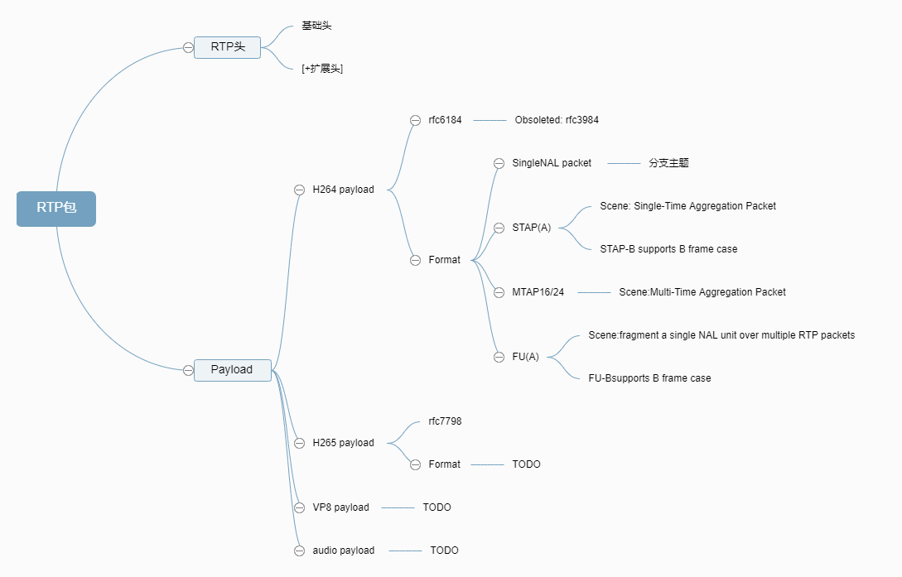

# RTP打包详解

## 0. 一览



## 1. RTP报文头

### 1.1 基本格式

```txt
+---------------+---------------+---------------+---------------+
|       0       |       1       |       2       |       3       |
|0|1|2|3|4|5|6|7|0|1|2|3|4|5|6|7|0|1|2|3|4|5|6|7|0|1|2|3|4|5|6|7|
+-+-+-+-+-+-+-+-+-+-+-+-+-+-+-+-+-+-+-+-+-+-+-+-+-+-+-+-+-+-+-+-+ 
| V |P|X|   CC  |M|     PT      |     SN(sequence number)       | 
+-+-+-+-+-+-+-+-+-+-+-+-+-+-+-+-+-+-+-+-+-+-+-+-+-+-+-+-+-+-+-+-+ 
|                           timestamp                           | 
+-+-+-+-+-+-+-+-+-+-+-+-+-+-+-+-+-+-+-+-+-+-+-+-+-+-+-+-+-+-+-+-+ 
|           synchronization source (SSRC) identifier            | 
+=+=+=+=+=+=+=+=+=+=+=+=+=+=+=+=+=+=+=+=+=+=+=+=+=+=+=+=+=+=+=+=+ 
|            contributing source (CSRC) identifiers             | 
|                             ....                              | 
+-+-+-+-+-+-+-+-+-+-+-+-+-+-+-+-+-+-+-+-+-+-+-+-+-+-+-+-+-+-+-+-+ 
```

1. `V`：RTP协议的版本号，占2位，当前协议版本号为2。

2. `P`：填充标志，占1位，如果P=1，则在该报文的尾部填充一个或多个额外的八位组，它们不是有效载荷的一部分。

3. `X`：扩展标志，占1位，如果X=1，则在RTP报头后跟有一个扩展报头。

4. `CC`：CSRC计数器，占4位，指示CSRC 标识符的个数。

5. `M`: 标记，占1位，不同的有效载荷有不同的含义，对于视频，标记一帧的结束；对于音频，标记会话的开始。如果没有该标志，则需要接收到下一个包后才知道是否一帧数据完整。

6. `PT`: 有效载荷类型，占7位，用于说明RTP报文中有效载荷的类型，如GSM音频、JPEM图像等,在流媒体中大部分是用来区分音频流和视频流的，这样便于客户端进行解析。

7. `SN`: 序列号，占16位，用于标识发送者所发送的RTP报文的序列号，每发送一个报文，序列号增1。这个字段当下层的承载协议用UDP的时候，网络状况不好的时候可以用来检查丢包。同时出现网络抖动的情况可以用来对数据进行重新排序，在helix服务器中这个字段是从0开始的，同时音频包和视频包的sequence是分别记数的。

8. `timestamp`: 时戳，占32位，时戳反映了该RTP报文的第一个八位组的采样时刻。接收者使用时戳来计算延迟和延迟抖动，并进行同步控制。

9. `SSRC`: 同步信源标识符，占32位，用于标识同步信源。该标识符是随机选择的，参加同一视频会议的两个同步信源不能有相同的SSRC。

10. `CSRC`: 特约信源标识符，每个CSRC标识符占32位，可以有0～15个。每个CSRC标识了包含在该RTP报文有效载荷中的所有特约信源。
    * 同步信源是指产生媒体流的信源，它通过RTP报头中的一个32位数字SSRC标识符来标识，而不依赖于网络地址，接收者将根据SSRC标识符来区分不同的信源，进行RTP报文的分组。
    * 特约信源是指当混合器接收到一个或多个同步信源的RTP报文后，经过混合处理产生一个新的组合RTP报文，并把混合器作为组合RTP报文的SSRC，而将原来所有的SSRC都作为CSRC传送给接收者，使接收者知道组成组合报文的各个SSRC。

### 1.2 头部扩展

如果扩展标志被置位则说明紧跟在报头后面，其格式如下：

```txt
+---------------+---------------+---------------+---------------+
|       0       |       1       |       2       |       3       |
|0|1|2|3|4|5|6|7|0|1|2|3|4|5|6|7|0|1|2|3|4|5|6|7|0|1|2|3|4|5|6|7|
+-+-+-+-+-+-+-+-+-+-+-+-+-+-+-+-+-+-+-+-+-+-+-+-+-+-+-+-+-+-+-+-+
|      defined by profile       |           length              |
+-+-+-+-+-+-+-+-+-+-+-+-+-+-+-+-+-+-+-+-+-+-+-+-+-+-+-+-+-+-+-+-+
|                        header extension                       |
|                             ....                              |
```

## 2. RTP H.264载荷

### 2.1 H264 NALU格式

* 在H.264视频编码标准中，整个系统框架被分为了两个层面：视频编码层面（VCL）和网络抽象层面（NAL）。
    * VCL负责有效表示视频数据的内容，比如：Codec的信令处理，转换、量化、运动补偿预测机制，以及循环过滤器等
    * NAL负责格式化数据并提供头信息（即封装VCL输出的片断），以保证数据以`包`的形式适用于各种信道（如网络）和存储介质上的传输和多路复用。

* 通常，H264 NALU由`Start Code`+`NALU Header`+`NALU Payload(RBSP)`三部分组成
    * 单Slice或者多Slice的第一个分片一般都包含3~4个字节的`Start Code：0x00 00 [00] 01`

### 2.2 H264 NALU header

一个字节的NALU Header格式如下：

```txt
+---------------+
|0|1|2|3|4|5|6|7|
+-+-+-+-+-+-+-+-+
|F|NRI|  Type   |
+---------------+
```

1. `F`: 1 bit，forbidden_zero_bit. H.264规范声明为0

2. `NRI`: 2 bits，nal_ref_idc，表示该NALU是否用于帧间图像预测来重构参考图像。即0值表示解码时可丢弃，非0值表示解码时不可丢弃。具体取值可参见下表

3. `Type`: 5 bits，nal_unit_type，NALU类型.

    |NAL Unit Type|含义|NRI (binary)|
    |--|---|-|
    |1|非IDR Slice|10|
    |2|非IDR Slice的A分区|10|
    |3|非IDR Slice的B分区|01|
    |4|非IDR Slice的C分区|01|
    |5|IDR Slice|11|
    |6|SEI: 补充增强信息|00|
    |7|SPS: 序列参数集|11|
    |8|PPS: 图像参数集|11|
    |9|AUD: 访问单元分割符|00|
    |10|序列结束符|00|
    |11|流结束符|00|
    |12|填充数据|00|
    |13–23|保留|-|

4. 取值算法

    ```C
    nalu->forbidden_bit = ((nalu->buf) >> 7) & 1;
    nalu->nal_reference_idc = (NalRefIdc) (((nalu->buf) >> 5) & 3);
    nalu->nal_unit_type = (NaluType) ((*(nalu->buf)) & 0x1f);
    ```

### 2.2 打包和解包

#### 打包模式和格式

* H264 payload on RTP有3种打包模式，7种打包格式

    ```txt
    Payload Packet    Single NAL    Non-Interleaved    Interleaved
    Type    Type      Unit Mode           Mode             Mode
    -------------------------------------------------------------
    0      reserved      ig               ig               ig
    1-23   NAL unit     yes              yes               no
    24     STAP-A        no              yes               no
    25     STAP-B        no               no              yes
    26     MTAP16        no               no              yes
    27     MTAP24        no               no              yes
    28     FU-A          no              yes              yes
    29     FU-B          no               no              yes
    30-31  reserved      ig               ig               ig
    ```

* 打包格式

    * 单个NALU打包：即将一个NALU打包到一个RTP包的payload中

    * 聚合打包：当数据包比较小时，可以将多个NALU聚合到一个RTP payload中
        * STAP-A/B组包：多个相同时间戳的NALU组包
        * MTAP16/24组包：多个不同时间戳的NALU组包

    * 分片打包：当一个NALU比较大时（即RTP包+UDP头+IP头大于MTU）, 可以分到多个RTP包中发送
        * FU-A/B分片：一个NALU分片到多个RTP包

* 打包模式

    * Single NAL Unit Mode，单个NAL单元模式(NAL unit)。这种模式用于单个一个RTP包封装一个NAL unit的情况

    * Non-Interleaved Mode，非交错模式(NAL unit/STAP-A/FU-A)。这种模式用于非B帧类型的NAL单元封装

    * Interleaved Mode，交错模式(STAP-B/MTAP16/MTAP24/FU-A/FU-B)，这种模式可以用于带B帧类型的NAL单元封装

#### 单个NAL打包

* RTP payload格式如下：

    ```txt
    +---------------+---------------+---------------+---------------+
    |       0       |       1       |       2       |       3       |
    |0|1|2|3|4|5|6|7|0|1|2|3|4|5|6|7|0|1|2|3|4|5|6|7|0|1|2|3|4|5|6|7|
    +-+-+-+-+-+-+-+-+-+-+-+-+-+-+-+-+-+-+-+-+-+-+-+-+-+-+-+-+-+-+-+-+
    |F|NRI| type    |                                               |
    +-+-+-+-+-+-+-+-+                                               |
    |                                                               |
    |              Bytes 2..n of a Single NAL unit                  |
    |                                                               |
    |                             +-+-+-+-+-+-+-+-+-+-+-+-+-+-+-+-+-|
    |                             :...OPTIONAL RTP padding          |
    +-+-+-+-+-+-+-+-+-+-+-+-+-+-+-+-+-+-+-+-+-+-+-+-+-+-+-+-+-+-+-+-+
    ```

* 打包流程：

    1. 剥离NALU起始`Start Code`

    2. NALU type值不变：NALU header和 NALU payload即为rtp的payload

* 例如

    * 有一个 H.264 的 NALU 是: [00 0000 0167 42A01E 2356 0E 2F ... ]；

    * RTP打包：[RTPHeader ] [6742A01E 23 560E 2F ...]

    * RTP解包：RTP payload加上[00000001]即可

#### STAP聚合打包

* STAP(A)的基本格式如下：STAP header + 多个Single NAL unit聚合

* STAP-B比基本格式多`DON`(decoding order number)字段，一般只有存在B帧的时候才会用到B结构，即解码顺序和包顺序不同

    ```txt
    Payload format for STAP-A
    +---------------+---------------+---------------+---------------+
    |       0       |       1       |       2       |       3       |
    |0|1|2|3|4|5|6|7|0|1|2|3|4|5|6|7|0|1|2|3|4|5|6|7|0|1|2|3|4|5|6|7|
    +-+-+-+-+-+-+-+-+-+-+-+-+-+-+-+-+-+-+-+-+-+-+-+-+-+-+-+-+-+-+-+-+
    |F|NRI|  Type   |                                               |
    +-+-+-+-+-+-+-+-+                                               |
    |                                                               |
    |               single-time aggregation units                   |
    |                                                               |
    |                               +-+-+-+-+-+-+-+-+-+-+-+-+-+-+-+-+
    |                               :...OPTIONAL RTP padding        |
    +-+-+-+-+-+-+-+-+-+-+-+-+-+-+-+-+-+-+-+-+-+-+-+-+-+-+-+-+-+-+-+-+

    Payload format for STAP-B
    +---------------+---------------+---------------+---------------+
    |       0       |       1       |       2       |       3       |
    |0|1|2|3|4|5|6|7|0|1|2|3|4|5|6|7|0|1|2|3|4|5|6|7|0|1|2|3|4|5|6|7|
    +-+-+-+-+-+-+-+-+-+-+-+-+-+-+-+-+-+-+-+-+-+-+-+-+-+-+-+-+-+-+-+-+
    |F|NRI|  Type   |               DON             |               |
    +-+-+-+-+-+-+-+-+-+-+-+-+-+-+-+-+-+-+-+-+-+-+-+-+               |
    |                                                               |
    |               single-time aggregation units                   |
    |                                                               |
    |                               +-+-+-+-+-+-+-+-+-+-+-+-+-+-+-+-+
    |                               :...OPTIONAL RTP padding        |
    +-+-+-+-+-+-+-+-+-+-+-+-+-+-+-+-+-+-+-+-+-+-+-+-+-+-+-+-+-+-+-+-+
    ```

    1. `F`，1 bit，同第一个NAL的`F`
    2. `NRI`, 2 bits，同第一个NAL的`NRI`
    3. `Type`， 5 bits，STAP-A为24，STAP-B为25
    4. `DON`， 2 bytes，解码顺序码，用于标记B帧和其他帧的解码顺序
    5. `single-time aggregation units`，多个Single NALU聚合格式：`NALU1.size(16 bits) + NALU1 + NALU2.size + NALU2 + ...`

* STAP-A示例：一个RTP包包含两个时间戳相同的NALU

    ```txt
    +---------------+---------------+---------------+---------------+
    |       0       |       1       |       2       |       3       |
    |0|1|2|3|4|5|6|7|0|1|2|3|4|5|6|7|0|1|2|3|4|5|6|7|0|1|2|3|4|5|6|7|
    +-+-+-+-+-+-+-+-+-+-+-+-+-+-+-+-+-+-+-+-+-+-+-+-+-+-+-+-+-+-+-+-+
    |                          RTP Header                           |
    +-+-+-+-+-+-+-+-+-+-+-+-+-+-+-+-+-+-+-+-+-+-+-+-+-+-+-+-+-+-+-+-+
    |STAP-A NAL HDR |         NALU 1 Size           | NALU 1 HDR    |
    +-+-+-+-+-+-+-+-+-+-+-+-+-+-+-+-+-+-+-+-+-+-+-+-+-+-+-+-+-+-+-+-+
    |                         NALU 1 Data                           |
    :                                                               :
    +               +-+-+-+-+-+-+-+-+-+-+-+-+-+-+-+-+-+-+-+-+-+-+-+-+
    |               | NALU 2 Size                   | NALU 2 HDR    |
    +-+-+-+-+-+-+-+-+-+-+-+-+-+-+-+-+-+-+-+-+-+-+-+-+-+-+-+-+-+-+-+-+
    |                         NALU 2 Data                           |
    :                                                               :
    |                               +-+-+-+-+-+-+-+-+-+-+-+-+-+-+-+-+
    |                               :...OPTIONAL RTP padding        |
    +-+-+-+-+-+-+-+-+-+-+-+-+-+-+-+-+-+-+-+-+-+-+-+-+-+-+-+-+-+-+-+-+
    ```

#### MTAP聚合打包

* MTAP分MTAP16和MTAP24，MTAP24比MTAP16多出8位时间戳偏移(TS offset)，其他都是一样的

* MTAP16示例：一个RTP包包含两个时间戳不同的NALU

    ```txt
    +---------------+---------------+---------------+---------------+
    |       0       |       1       |       2       |       3       |
    |0|1|2|3|4|5|6|7|0|1|2|3|4|5|6|7|0|1|2|3|4|5|6|7|0|1|2|3|4|5|6|7|
    +-+-+-+-+-+-+-+-+-+-+-+-+-+-+-+-+-+-+-+-+-+-+-+-+-+-+-+-+-+-+-+-+
    |                          RTP Header                           |
    +-+-+-+-+-+-+-+-+-+-+-+-+-+-+-+-+-+-+-+-+-+-+-+-+-+-+-+-+-+-+-+-+
    |MTAP16 NAL HDR |  DONB                         | NALU 1 Size   |
    +-+-+-+-+-+-+-+-+-+-+-+-+-+-+-+-+-+-+-+-+-+-+-+-+-+-+-+-+-+-+-+-+
    |  NALU 1 Size' |  NALU 1 DOND  |       NALU 1 TS offset        |
    +-+-+-+-+-+-+-+-+-+-+-+-+-+-+-+-+-+-+-+-+-+-+-+-+-+-+-+-+-+-+-+-+
    |  NALU 1 HDR   |  NALU 1 DATA                                  |
    +-+-+-+-+-+-+-+-+                                               +
    :                                                               :
    +               +-+-+-+-+-+-+-+-+-+-+-+-+-+-+-+-+-+-+-+-+-+-+-+-+
    |               | NALU 2 SIZE                   |  NALU 2 DOND  |
    +-+-+-+-+-+-+-+-+-+-+-+-+-+-+-+-+-+-+-+-+-+-+-+-+-+-+-+-+-+-+-+-+
    |       NALU 2 TS offset        |  NALU 2 HDR   |  NALU 2 DATA  |
    +-+-+-+-+-+-+-+-+-+-+-+-+-+-+-+-+-+-+-+-+-+-+-+-+               |
    :                                                               :
    |                               +-+-+-+-+-+-+-+-+-+-+-+-+-+-+-+-+
    |                               :...OPTIONAL RTP padding        |
    +-+-+-+-+-+-+-+-+-+-+-+-+-+-+-+-+-+-+-+-+-+-+-+-+-+-+-+-+-+-+-+-+
    ```

    1. `MTAP16 NAL HDR`，1 byte，和STAP NAL HDR、H264 NAL HDR格式一致，只是Type值的差别
    2. `DONB：decoding order number base`，DON的基础值，为第一个NALU的DON值
    3. `multi-time aggregation units`，多个NALU聚合格式：`NALU1.size(16 bits) + NALU1.DOND + NALU1.TSOffset + NALU1 + ...`
    4. `DOND: Decoding Order Number Difference`, 算法：`NALU.DON = (MTAP.DONB + NALU.DOND) % 65536`
    5. `TS offset`，算法：

        ```python
        if NALU.time >= RTP.timestamp:
            NALU.TSOffset = NALU.time - RTP.timestamp
        else:
            NALU.TSOffset = NALU.time + (2^32 - RTP.timestamp)
        ```

#### FU分片打包

* FU(A)基本格式为：1字节的分片单元指示(FU indicator) + 1字节的分片单元头(FU header) + 分片单元荷载(FU payload)

* FU-B比基本格式多`DON`(decoding order number)字段，一般只有存在B帧的时候才会用到B结构，即解码顺序和包顺序不同

    ```txt
    Payload format for FU-A
    +---------------+---------------+---------------+---------------+
    |       0       |       1       |       2       |       3       |
    |0|1|2|3|4|5|6|7|0|1|2|3|4|5|6|7|0|1|2|3|4|5|6|7|0|1|2|3|4|5|6|7|
    +-+-+-+-+-+-+-+-+-+-+-+-+-+-+-+-+-+-+-+-+-+-+-+-+-+-+-+-+-+-+-+-+
    | FU indicator  | FU header     |                               |
    +-+-+-+-+-+-+-+-+-+-+-+-+-+-+-+-+                               |
    |                                                               |
    |                         FU payload                            |
    |                                                               |
    |                               +-+-+-+-+-+-+-+-+-+-+-+-+-+-+-+-+
    |                               :...OPTIONAL RTP padding        |
    +-+-+-+-+-+-+-+-+-+-+-+-+-+-+-+-+-+-+-+-+-+-+-+-+-+-+-+-+-+-+-+-+

    Payload format for FU-B
    +---------------+---------------+---------------+---------------+
    |       0       |       1       |       2       |       3       |
    |0|1|2|3|4|5|6|7|0|1|2|3|4|5|6|7|0|1|2|3|4|5|6|7|0|1|2|3|4|5|6|7|
    +-+-+-+-+-+-+-+-+-+-+-+-+-+-+-+-+-+-+-+-+-+-+-+-+-+-+-+-+-+-+-+-+
    | FU indicator  |   FU header   |               DON             |
    +-+-+-+-+-+-+-+-+-+-+-+-+-+-+-+-+-+-+-+-+-+-+-+-+-+-+-+-+-+-+-+-|
    |                                                               |
    |                         FU payload                            |
    |                                                               |
    |                               +-+-+-+-+-+-+-+-+-+-+-+-+-+-+-+-+
    |                               :...OPTIONAL RTP padding        |
    +-+-+-+-+-+-+-+-+-+-+-+-+-+-+-+-+-+-+-+-+-+-+-+-+-+-+-+-+-+-+-+-+
    ```

* FU indicator格式:

    ```txt
    +---------------+
    |0|1|2|3|4|5|6|7|
    +-+-+-+-+-+-+-+-+
    |F|NRI| Type    |
    +---------------+
    ```

    * `F`: 1 bit, 即为NALU header的`F`
    * `NRI`: 2 bits，即为NALU header的`NRI`
    * `Type`: 5 bits，FU-A为28,FU-B为29

* FU头(header)的格式如下:

    ```txt
    +---------------+
    |0|1|2|3|4|5|6|7|
    +-+-+-+-+-+-+-+-+
    |S|E|R| Type    |
    +---------------+
    ```
    
    * `S`: 1 bit，开始位，1：指示分片NAL单元的开始；0：当跟随的FU荷载不是分片NAL单元荷载的开始
    * `E`: 1 bit，结束位，1：指示分片NAL单元的结束,即荷载的最后字节也是分片NAL单元的最后一个字节. 0：当跟随的FU荷载不是分片NAL单元的最后分片；
    * `R`: 1 bit，保留位必须设置为0.
    * `Type`: 5 bits，原NALU的`Type`

* FU-A打包示例

    ```C
    m_indicator[0] = m_NAL[0] & 0xe0;        // F = NALU 头中的 F;NRI = NALU 头中的 NRI
    m_indicator[0] = m_indicator [0] + 0x1C; // Type = 28

    // 第一个包
    m_header[1] = 0x80 + (m_NAL[0]&0x1f);    // S = 1;E = 0;R = 0;Type = NALU 头中的 Type

    // 中间包
    m_header[1] = 0x60 + (m_NAL[0]&0x1f);    // S = 0;E = 0;R = 0;Type = NALU 头中的 Type

    // 最后一个包
    m_header[1] = 0x10 + (m_NAL[0]&0x1f);    // S = 0;E = 1;R = 0;Type = NALU 头中的 Type
    ```

* FU-A解包示例

    ```C
    unsigned char startBit = headerStart[1] & 0x80;
    unsigned char endBit = headerStart[1] & 0x40;
    if (startBit == 1) {
        // 首包, 重新组合NAL单元类型字节, 再在NAL头字节前面加上[00000001]
        m_NAL[0] = (headerStart[0]&0xE0) + (headerStart[1]&0x1F);
    } else {
        // 直接丢掉headerStart[0] headerStart[1]
    }
    ```

### 2.3 码流示例

#### x264带sps,pps

```txt
//I帧
00 00 00 01 67 4D 40 1F DB 01 40 16 E8 40 00 00 
03 00 40 00 00 0F 23 C6 0C B8 00 00 00 01 68 EA 
CC B2 00 00 01 06 .. 80 00 00 01 65 88 ..
//P帧
00 00 00 01 41 ..
```

#### QSV带SPS,PPS

```txt
//I帧
00 00 00 01 09 10 00 00 00 01 27 4D 00 20 95 A0 
14 01 6E C0 44 00 00 03 00 04 00 00 03 01 83 81 
00 01 3D 60 00 04 F5 8E F7 BE 0E D0 E1 95 00 00 
00 01 28 EE 3C 80 00 00 00 01 06 00 07 80 AF 3E 
80 B0 53 C0 01 07 00 00 03 00 00 03 00 00 04 80 
00 00 01 25 ..
//P帧
00 00 00 01 09 30 00 00 00 01 28 EE 3C 80 00 00 
00 01 06 01 07 00 00 03 02 00 00 03 00 04 80 00 
00 01 21 ..
```

## 3. RTP H.265载荷

* H.265的分层与H.264类似：VCL和NAL

* 区别在于H265 NALU HDR为2个字节
  
### 3.1 H265 NALU header

H265两个字节的NALU头格式如下：

***以下未验证***

```txt
+---------------+---------------+
|0|1|2|3|4|5|6|7|0|1|2|3|4|5|6|7|
+-+-+-+-+-+-+-+-+-+-+-+-+-+-+-+-+
|F|   Type    |  LayerId  | TID |
+-------------+-----------------+
```

1. `F` (1bit): forbidden_zero_bit. 固定为0

2. `Type` (6bit): nal_unit_type. 当前NALU类型
    
    |值|含义|
    |--|---|
    |19|IDR|
    |32|VPS|
    |33|SPS|
    |34|PPS|
    |35|AUD|
    |39|SEI|

3. `LayerId` (6bit): nuh_layer_id. 编码层级信息

4. `TID` (3bit): nuh_temporal_id_plus1. 时间分级信息

5. 取值算法

    ```C
    forbidden_zero_bit = (pData[0]>>7) & 0x1
    nalu.m_nalUnitType = (pData[0]>>1) & 0x3F
    nalu.m_nuhLayerId = (pData[0] & 0x1 << 5) + (pData[1]>>3) & 0x1F
    nalu.m_temporalId = (pData[1] & 0x7) - 1
    ```

### 3.2 打包和解包

*TODO*

### 3.3 示例

*TODO*

## 4. RTP VP8载荷

### 4.1 一般格式

```txt
+---------------+---------------+---------------+---------------+
|       0       |       1       |       2       |       3       |
|0|1|2|3|4|5|6|7|0|1|2|3|4|5|6|7|0|1|2|3|4|5|6|7|0|1|2|3|4|5|6|7|
+-+-+-+-+-+-+-+-+-+-+-+-+-+-+-+-+-+-+-+-+-+-+-+-+-+-+-+-+-+-+-+-+
|V=2|P|X|  CC   |M|     PT      |       sequence number         |
+-+-+-+-+-+-+-+-+-+-+-+-+-+-+-+-+-+-+-+-+-+-+-+-+-+-+-+-+-+-+-+-+
|                           timestamp                           |
+-+-+-+-+-+-+-+-+-+-+-+-+-+-+-+-+-+-+-+-+-+-+-+-+-+-+-+-+-+-+-+-+
|           synchronization source (SSRC) identifier            |
+=+=+=+=+=+=+=+=+=+=+=+=+=+=+=+=+=+=+=+=+=+=+=+=+=+=+=+=+=+=+=+=+
|            contributing source (CSRC) identifiers             |
|                             ....                              |
+=+=+=+=+=+=+=+=+=+=+=+=+=+=+=+=+=+=+=+=+=+=+=+=+=+=+=+=+=+=+=+=+
|            VP8 payload descriptor (integer #bytes)            |
:                                                               :
|                               +-+-+-+-+-+-+-+-+-+-+-+-+-+-+-+-+
|                               : VP8 payload header (3 octets) |
+-+-+-+-+-+-+-+-+-+-+-+-+-+-+-+-+-+-+-+-+-+-+-+-+-+-+-+-+-+-+-+-+
| VP8 pyld hdr  :                                               |
+-+-+-+-+-+-+-+-+                                               |
:                   Bytes 4..N of VP8 payload                   :
|                                                               |
|                               +-+-+-+-+-+-+-+-+-+-+-+-+-+-+-+-+
|                               :    OPTIONAL RTP padding       |
+-+-+-+-+-+-+-+-+-+-+-+-+-+-+-+-+-+-+-+-+-+-+-+-+-+-+-+-+-+-+-+-+
```

* M: 标记，占1位，不同的有效载荷有不同的含义，对于视频，标记一帧的结束；对于音频，标记会话的开始。如果没有该标志，则需要接收到下一个包后才知道是否一帧数据完整。

* 时戳(Timestamp)：占32位，时戳反映了该RTP报文的第一个八位组的采样时刻(90HZ)。接收者使用时戳来计算延迟和延迟抖动，并进行同步控制。

* 序列号：占16位，用于标识发送者所发送的RTP报文的序列号，每发送一个报文，序列号增1。这个字段当下层的承载协议用UDP的时候，网络状况不好的时候可以用来检查丢包。同时出现网络抖动的情况可以用来对数据进行重新排序，在helix服务器中这个字段是从0开始的，同时音频包和视频包的sequence是分别记数的。

### 4.2 VP8 Payload Descriptor

rtp头之后的第一个字节流是VP8 payload descriptor,格式如下：

```txt
+---------------+---------------+---------------+---------------+
|       0       |       1       |       2       |       3       |
|0|1|2|3|4|5|6|7|0|1|2|3|4|5|6|7|0|1|2|3|4|5|6|7|0|1|2|3|4|5|6|7|
+-+-+-+-+-+-+-+-+-+-+-+-+-+-+-+-+-+-+-+-+-+-+-+-+-+-+-+-+-+-+-+-+
| RSV |I|N|FI |B|   PictureID (1 or 2 octets)   |               |
+-+-+-+-+-+-+-+-+-+-+-+-+-+-+-+-+-+-+-+-+-+-+-+-+               |
|        (VP8 data or VP8 payload header; byte aligned)         |
+-+-+-+-+-+-+-+-+-+-+-+-+-+-+-+-+-+-+-+-+-+-+-+-+-+-+-+-+-+-+-+-+
```

* `RSV`: 3 bits,预留字段,must设置为0,接收者must忽略该字段。

* `I`: 1 bit,PictureID标志,当设置为1时，在payload descriptor第一个字节之后需要填充PictureID值。相反如果设置为0,PictureID将会被忽略，payload descriptor之后紧接着的是vp8 payload。

* `N`：1 bit,表示Non-reference frame(非参考帧).当设置为1，表示这帧数据可以被丢弃而不影响之前和之后的数据帧。如果不知道这帧数据的引用情况，这个bit位should设置为0，因为可能有其他帧引用它。
    * 注：这个文档不会告诉你如何判断一帧数据是否为非参考帧，Non-reference的判断由编码器文档说明
    
* `FI`：2 bits,该字段包含VP8 payload分片(fragmentation )承载于RTP包信息，有一下四个值：
    * 00：vp8 partition没有被分片(fragmented),payload中可能包含一个或多个完整的partition
    * 01：rtp payload以vp8 partition的开头作为起始，我的理解是第一个octet相同
    * 10：rtp payload以vp8 partition的最后部分作为结束，我的理解是最后一个octet相同
    * 11：当payload的第一个八比特位(octet)不是vp8 partition的第一个八bit位，而且payload的最后一个octet不是partition的最后一个octet，那么这个字段should设置为11；01或者10的情况出现时，这个字段may也有可能设置为11；当这个rtp承载的是一帧编码数据的第一个或者最后一个包时，这个字段MUST NOT设置为11.

* `B`: 1 bit,VP8帧的起始标志，当设置为1时表示rtp包承载了一帧新的vp8数据，如果这样，这个数据包以a partition of the first (prediction/mode) type作为起始。

* `PictureID`:8 or 16 bits,当I标志位设置为1时，才有该字段,表示数据帧的动态index。第一个八位bit的最高位是一个扩展标志，后7位真正表示PictureID，如果扩展标志被设置，那么接下来的8位比特也将作为index的低8位，共计15个bit. PictureID should从一个随机数开始，当达到最大值后must转换。

### 4.3 VP8 Payload Header

```txt
+---------------+---------------+---------------+---------------+
|       0       |       1       |       2       |       3       |
|0|1|2|3|4|5|6|7|0|1|2|3|4|5|6|7|0|1|2|3|4|5|6|7|0|1|2|3|4|5|6|7|
+-+-+-+-+-+-+-+-+-+-+-+-+-+-+-+-+-+-+-+-+-+-+-+-+-+-+-+-+-+-+-+-+
|Size0|H| VER |P|     Size1     |     Size2     |               |
+-+-+-+-+-+-+-+-+-+-+-+-+-+-+-+-+-+-+-+-+-+-+-+-+               |
|                                                               |
:                   Bytes 4..N of VP8 payload                   :
|                                                               |
|                               +-+-+-+-+-+-+-+-+-+-+-+-+-+-+-+-|
|                               :    OPTIONAL RTP padding       |
+-+-+-+-+-+-+-+-+-+-+-+-+-+-+-+-+-+-+-+-+-+-+-+-+-+-+-+-+-+-+-+-+
```

* 前三个8bit：一帧VP8编码数据的前三个8bit位将会引用作为一个“未编码数据块”(uncompressed data chunk)存在[I-D.bankoski-vp8-bitstream]中，而在rtp格式中，将放在payload head中。这个编码的bit流指定了两种变形：
    * interframe(内部帧？)用三个8bit表示；
    * Key帧用10个8bit表示。
    * 对于这两种变形，前三个octet意义是一样的。对于Key帧，剩下的7个octet建议存放剩余payload。值得注意的是：只有当B标志位为1时，这个payload header才会存在，即同一帧数据的后续包是没有这个header的。

* `SizeN`：通过1stPartitionSize = Size0 + 8 * Size1 + 2048 * Size2.计算出各个size的大小。其中1stPartitionSize是第一个vp8 partition的字节大小。详细参见[I-D.bankoski-vp8-bitstream]

* `H`：Show frame bit，如在[I-D.bankoski-vp8-bitstream]定义的

* `VER`：[I-D.bankoski-vp8-bitstream]中定义的版本号

* `P`：非Key帧的标识。当设置为0，表示当前帧为key帧，如果为1，表示为interframe内部帧。如[I-D.bankoski-vp8-bitstream]中定义

### 4.4 几个示例

1. Key frame in a single RTP packet

```txt
Marker bit = 1.  I = 1.  B = 1.  PictureID = 17 = 0001001 binary.  P = 0.
+---------------+---------------+---------------+---------------+
|       0       |       1       |       2       |       3       |
|0|1|2|3|4|5|6|7|0|1|2|3|4|5|6|7|0|1|2|3|4|5|6|7|0|1|2|3|4|5|6|7|
+-+-+-+-+-+-+-+-+-+-+-+-+-+-+-+-+-+-+-+-+-+-+-+-+-+-+-+-+-+-+-+-+
|                       RTP Header M=1                          |
+-+-+-+-+-+-+-+-+-+-+-+-+-+-+-+-+-+-+-+-+-+-+-+-+-+-+-+-+-+-+-+-+
|0 0 0 1 0 0 0 1:0 0 0 0 1 0 0 1|Size0|1: VER :0|     Size1     |
+-+-+-+-+-+-+-+-+-+-+-+-+-+-+-+-+-+-+-+-+-+-+-+-+-+-+-+-+-+-+-+-+
|     Size2     |                                               |
+-+-+-+-+-+-+-+-+                                               |
|                                                               |
:                Bytes 4..L of first VP8 partition              :
|                                                               |
|                               +-+-+-+-+-+-+-+-+-+-+-+-+-+-+-+-+
|                               |                               |
+-+-+-+-+-+-+-+-+-+-+-+-+-+-+-+-+                               |
|                                                               |
:                Remaining VP8 partitions                       :
|                                                               |
|                               +-+-+-+-+-+-+-+-+-+-+-+-+-+-+-+-|
|                               :    OPTIONAL RTP padding       |
+-+-+-+-+-+-+-+-+-+-+-+-+-+-+-+-+-+-+-+-+-+-+-+-+-+-+-+-+-+-+-+-+
```

2. VP8 interframe in a single RTP packet; no PictureID

```txt
Marker bit = 1.  I = 0.  B = 1.  P = 1.
+---------------+---------------+---------------+---------------+
|       0       |       1       |       2       |       3       |
|0|1|2|3|4|5|6|7|0|1|2|3|4|5|6|7|0|1|2|3|4|5|6|7|0|1|2|3|4|5|6|7|
+-+-+-+-+-+-+-+-+-+-+-+-+-+-+-+-+-+-+-+-+-+-+-+-+-+-+-+-+-+-+-+-+
|                       RTP Header M=1                          |
+-+-+-+-+-+-+-+-+-+-+-+-+-+-+-+-+-+-+-+-+-+-+-+-+-+-+-+-+-+-+-+-+
|0 0 0 0 0 0 0 1|Size0|1: VER :1|     Size1     |     Size2     |
+-+-+-+-+-+-+-+-+-+-+-+-+-+-+-+-+-+-+-+-+-+-+-+-+-+-+-+-+-+-+-+-+
|                                                               |
:                Bytes 4..L of first VP8 partition              :
|                                                               |
|                               +-+-+-+-+-+-+-+-+-+-+-+-+-+-+-+-+
|                               |                               |
+-+-+-+-+-+-+-+-+-+-+-+-+-+-+-+-+                               |
|                                                               |
:                Remaining VP8 partitions                       :
|                                                               |
|                               +-+-+-+-+-+-+-+-+-+-+-+-+-+-+-+-|
|                               :    OPTIONAL RTP padding       |
+-+-+-+-+-+-+-+-+-+-+-+-+-+-+-+-+-+-+-+-+-+-+-+-+-+-+-+-+-+-+-+-+
```

3. VP8 partitions in separate RTP packets

```txt
First RTP packet; marker bit = 0.  I = 1.  B = 1.  PictureID = 17.
+---------------+---------------+---------------+---------------+
|       0       |       1       |       2       |       3       |
|0|1|2|3|4|5|6|7|0|1|2|3|4|5|6|7|0|1|2|3|4|5|6|7|0|1|2|3|4|5|6|7|
+-+-+-+-+-+-+-+-+-+-+-+-+-+-+-+-+-+-+-+-+-+-+-+-+-+-+-+-+-+-+-+-+
|                       RTP Header M=0                          |
+-+-+-+-+-+-+-+-+-+-+-+-+-+-+-+-+-+-+-+-+-+-+-+-+-+-+-+-+-+-+-+-+
|0 0 0 1 0 0 0 1:0 0 0 0 1 0 0 1|Size0|1: VER :1|     Size1     |
+-+-+-+-+-+-+-+-+-+-+-+-+-+-+-+-+-+-+-+-+-+-+-+-+-+-+-+-+-+-+-+-+
|     Size2     |                                               |
+-+-+-+-+-+-+-+-+                                               |
|                                                               |
:                Bytes 4..L of first VP8 partition              :
|                                                               |
|                                                               |
|                                                               |
+-+-+-+-+-+-+-+-+-+-+-+-+-+-+-+-+-+-+-+-+-+-+-+-+-+-+-+-+-+-+-+-+

Second RTP packet; marker bit = 1.  B = 0.
+---------------+---------------+---------------+---------------+
|       0       |       1       |       2       |       3       |
|0|1|2|3|4|5|6|7|0|1|2|3|4|5|6|7|0|1|2|3|4|5|6|7|0|1|2|3|4|5|6|7|
+-+-+-+-+-+-+-+-+-+-+-+-+-+-+-+-+-+-+-+-+-+-+-+-+-+-+-+-+-+-+-+-+
|                       RTP Header M=1                          |
+-+-+-+-+-+-+-+-+-+-+-+-+-+-+-+-+-+-+-+-+-+-+-+-+-+-+-+-+-+-+-+-+
|0 0 0 1 0 0 0 0:0 0 0 0 1 0 0 1|                               |
+-+-+-+-+-+-+-+-+-+-+-+-+-+-+-+-+                               |
|                                                               |
:                Remaining VP8 partitions                       :
|                                                               |
|                               +-+-+-+-+-+-+-+-+-+-+-+-+-+-+-+-|
|                               :    OPTIONAL RTP padding       |
+-+-+-+-+-+-+-+-+-+-+-+-+-+-+-+-+-+-+-+-+-+-+-+-+-+-+-+-+-+-+-+-+
```

4. VP8 frame fragmented across RTP packets

```txt
First RTP packet; marker bit = 0.  I = 1.  FI = 00.  B = 1.
+---------------+---------------+---------------+---------------+
|       0       |       1       |       2       |       3       |
|0|1|2|3|4|5|6|7|0|1|2|3|4|5|6|7|0|1|2|3|4|5|6|7|0|1|2|3|4|5|6|7|
+-+-+-+-+-+-+-+-+-+-+-+-+-+-+-+-+-+-+-+-+-+-+-+-+-+-+-+-+-+-+-+-+
|                       RTP Header M=0                          |
+-+-+-+-+-+-+-+-+-+-+-+-+-+-+-+-+-+-+-+-+-+-+-+-+-+-+-+-+-+-+-+-+
|0 0 0 1 0 0 0 1:0 0 0 0 1 0 0 1|Size0|1: VER :1|     Size1     |
+-+-+-+-+-+-+-+-+-+-+-+-+-+-+-+-+-+-+-+-+-+-+-+-+-+-+-+-+-+-+-+-+
|     Size2     |                                               |
+-+-+-+-+-+-+-+-+                                               |
|                                                               |
:                Bytes 4..L of first VP8 partition              :
|                                                               |
|                                                               |
|                                                               |
+-+-+-+-+-+-+-+-+-+-+-+-+-+-+-+-+-+-+-+-+-+-+-+-+-+-+-+-+-+-+-+-+

Second RTP packet; marker bit = 0.  FI = 01.  B = 0.
+---------------+---------------+---------------+---------------+
|       0       |       1       |       2       |       3       |
|0|1|2|3|4|5|6|7|0|1|2|3|4|5|6|7|0|1|2|3|4|5|6|7|0|1|2|3|4|5|6|7|
+-+-+-+-+-+-+-+-+-+-+-+-+-+-+-+-+-+-+-+-+-+-+-+-+-+-+-+-+-+-+-+-+
|                       RTP Header M=0                          |
+-+-+-+-+-+-+-+-+-+-+-+-+-+-+-+-+-+-+-+-+-+-+-+-+-+-+-+-+-+-+-+-+
|0 0 0 1 0 0 1 0:0 0 0 0 1 0 0 1|                               |
+-+-+-+-+-+-+-+-+-+-+-+-+-+-+-+-+                               |
|                                                               |
:          First fragment of second VP8 partition               :
|                                                               |
+-+-+-+-+-+-+-+-+-+-+-+-+-+-+-+-+-+-+-+-+-+-+-+-+-+-+-+-+-+-+-+-+

Third RTP packet; marker bit = 0.  FI = 11.  B = 0.
+---------------+---------------+---------------+---------------+
|       0       |       1       |       2       |       3       |
|0|1|2|3|4|5|6|7|0|1|2|3|4|5|6|7|0|1|2|3|4|5|6|7|0|1|2|3|4|5|6|7|
+-+-+-+-+-+-+-+-+-+-+-+-+-+-+-+-+-+-+-+-+-+-+-+-+-+-+-+-+-+-+-+-+
|                       RTP Header M=0                          |
+-+-+-+-+-+-+-+-+-+-+-+-+-+-+-+-+-+-+-+-+-+-+-+-+-+-+-+-+-+-+-+-+
|0 0 0 1 0 1 1 0:0 0 0 0 1 0 0 1|                               |
+-+-+-+-+-+-+-+-+-+-+-+-+-+-+-+-+                               |
|                                                               |
:          Middle fragment of second VP8 partition              :
|                                                               |
+-+-+-+-+-+-+-+-+-+-+-+-+-+-+-+-+-+-+-+-+-+-+-+-+-+-+-+-+-+-+-+-+

Last RTP packet; marker bit = 1.  FI = 10.  B = 0.
+---------------+---------------+---------------+---------------+
|       0       |       1       |       2       |       3       |
|0|1|2|3|4|5|6|7|0|1|2|3|4|5|6|7|0|1|2|3|4|5|6|7|0|1|2|3|4|5|6|7|
+-+-+-+-+-+-+-+-+-+-+-+-+-+-+-+-+-+-+-+-+-+-+-+-+-+-+-+-+-+-+-+-+
|                       RTP Header M=1                          |
+-+-+-+-+-+-+-+-+-+-+-+-+-+-+-+-+-+-+-+-+-+-+-+-+-+-+-+-+-+-+-+-+
|0 0 0 1 0 1 0 0:0 0 0 0 1 0 0 1|                               |
+-+-+-+-+-+-+-+-+-+-+-+-+-+-+-+-+                               |
|                                                               |
:          Last fragment of second VP8 partition                :
|                                                               |
|                               +-+-+-+-+-+-+-+-+-+-+-+-+-+-+-+-|
|                               :    OPTIONAL RTP padding       |
+-+-+-+-+-+-+-+-+-+-+-+-+-+-+-+-+-+-+-+-+-+-+-+-+-+-+-+-+-+-+-+-+
```

5. VP8 frame with long PictureID

```txt
PictureID = 4711 = 001001001100111 binary (first 7 bits: 0010010, last 8 bits: 01100111).
+---------------+---------------+---------------+---------------+
|       0       |       1       |       2       |       3       |
|0|1|2|3|4|5|6|7|0|1|2|3|4|5|6|7|0|1|2|3|4|5|6|7|0|1|2|3|4|5|6|7|
+-+-+-+-+-+-+-+-+-+-+-+-+-+-+-+-+-+-+-+-+-+-+-+-+-+-+-+-+-+-+-+-+
|                       RTP Header M=1                          |
+-+-+-+-+-+-+-+-+-+-+-+-+-+-+-+-+-+-+-+-+-+-+-+-+-+-+-+-+-+-+-+-+
|0 0 0 1 0 0 0 1:1 0 0 1 0 0 1 0 0 1 1 0 0 1 1 1|Size0|1: VER :1|
+-+-+-+-+-+-+-+-+-+-+-+-+-+-+-+-+-+-+-+-+-+-+-+-+-+-+-+-+-+-+-+-+
|     Size1     |     Size2     |                               |
+-+-+-+-+-+-+-+-+-+-+-+-+-+-+-+-+                               |
|                                                               |
:                Bytes 4..N of first VP8 frame                  :
|                                                               |
+-+-+-+-+-+-+-+-+-+-+-+-+-+-+-+-+-+-+-+-+-+-+-+-+-+-+-+-+-+-+-+-+
```


