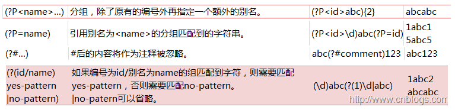

## PCRE 表达式

*整理自[wiki](https://zh.wikipedia.org/wiki/正则表达式#PCRE表达式全集)和经验*

### 1) 常用语法 

|字符|表达式|字符串|描述|
|---|---|---|---|
||||**----基础----**|
|\\|a\\.c|a.c|将下一个字符标记为一个特殊字符（File Format Escape，清单见本表）、或一个原义字符（Identity Escape，有^\$()\*+?\.\[\\{\|共计12个)、或一个向后引用（backreferences）、或一个八进制转义符。例如，“n”匹配字符“n”。“\n”匹配一个换行符。序列“\\\\”匹配“\\”而“\\(”则匹配“(”。
|.|a.c|abc|匹配除“\r”“\n”之外的任何单个字符。要匹配包括“\r”“\n”在内的任何字符，请使用像“(\.\|\\r\|\\n)”的模式。
|x\|y|z\|food (?:z\|f)ood|z food zood或food|没有包围在()里，其范围是整个正则表达式。总是优先从左边开始尝试匹配。
|[xyz]|a[bcd]e|abe ace ade|字符集合（character class）。匹配所包含的任意一个字符。例如，“[abc]”可以匹配“plain”中的“a”。特殊字符仅有反斜线\保持特殊含义，用于转义字符。其它特殊字符如星号、加号、各种括号等均作为普通字符。脱字符^如果出现在首位则表示负值字符集合；如果出现在字符串中间就仅作为普通字符。连字符 - 如果出现在字符串中间表示字符范围描述；如果如果出现在首位（或末尾）则仅作为普通字符。右方括号应转义出现，也可以作为首位字符出现。
|[^xyz]|a[^bcd]e|afe|排除型字符集合（negated character classes）。匹配未列出的任意字符。例如，“[^abc]”可以匹配“plain”中的“plin”。
|[a-z]|a[b-d]e|abe ace ade|字符范围。匹配指定范围内的任意字符。例如，“[a-z]”可以匹配“a”到“z”范围内的任意小写字母字符。
|[^a-z]|a[^b-d]e|afe|排除型的字符范围。匹配任何不在指定范围内的任意字符。例如，“[^a-z]”可以匹配任何不在“a”到“z”范围内的任意字符。
||||**----边界匹配----**|
|^|^abc|abc|匹配输入字符串的开始位置。如果设置了RegExp对象的Multiline属性，^也匹配“\n”或“\r”之后的位置。
|$|abc$|abc|匹配输入字符串的结束位置。如果设置了RegExp对象的Multiline属性，$也匹配“\n”或“\r”之前的位置。
|\b|er\b|never abc|匹配一个单词边界，也就\w和\W之间。
|\B|er\B|neverabc|匹配非单词边界。
|\A|\Aabc|abc|仅匹配输入字符串的开始位置；非标准？
|\Z|abc\Z|abc|仅匹配输入字符串的结束位置；非标准？
||||**----预定义字符----**|
|\d|a\dc|a1c|匹配一个数字字符。等价于[0-9]。注意Unicode正则表达式会匹配全角数字字符。
|\D|a\Dc|abc|匹配一个非数字字符。等价于[^0-9]和[^\d]。
|\s|a\sc|a c|匹配任何空白字符，包括空格、制表符、换页符等等。等价于[ \f\n\r\t\v]。注意Unicode正则表达式会匹配全角空格符。
|\S|a\Sc|abc|匹配任何非空白字符。等价于[^ \f\n\r\t\v]和[^\s]。
|\w|a\wc|abc|匹配包括下划线的任何单词字符。等价于“[A-Za-z0-9_]”。注意Unicode正则表达式会匹配中文字符。
|\W|a\Wc|a c|匹配任何非单词字符。等价于“[^A-Za-z0-9_]”和[^\w]。
|\f| | |匹配一个换页符。等价于\x0c和\cL。
|\n| | |匹配一个换行符。等价于\x0a和\cJ。
|\r| | |匹配一个回车符。等价于\x0d和\cM。
|\t| | |匹配一个制表符。等价于\x09和\cI。
|\v| | |匹配一个垂直制表符。等价于\x0b和\cK。
||||**----重复修饰符----**|
|\*|zo\*|z zo zoo|匹配前面的子表达式零次或多次,\*等价于{0,}。
|+|zo+|zo zoo|匹配前面的子表达式一次或多次。+等价于{1,}。
|?|do(es)?|do does|匹配前面的子表达式零次或一次。?等价于{0,1}。
|{n}|o{2}|food|n是一个非负整数。匹配确定的n次。
|{n,}|o{2,}|foood|n是一个非负整数。至少匹配n次。
|{n,m}|o{1,3}|food|m和n均为非负整数，其中n<=m。最少匹配n次且最多匹配m次。请注意在逗号和两个数之间不能有空格。
|?|o+?|对于oooo 将只匹配1个o而不是所有o|非贪心量化（Non-greedy quantifiers）：当该字符紧跟在任何一个其他重复修饰符（*,+,?,{n},{n,},{n,m}）后面时，匹配模式是非贪婪的。非贪婪模式尽可能少的匹配所搜索的字符串，而默认的贪婪模式则尽可能多的匹配所搜索的字符串。
||||**----分组----**|
|(pattern)| | |匹配pattern并获取这一匹配的子字符串。该子字符串用于向后引用。所获取的匹配可以从产生的Matches集合得到，在VBScript中使用SubMatches集合，在JScript中则使用$0…$9属性。要匹配圆括号字符，请使用“\\(”或“\\)”。可带数量后缀。
|(?:pattern)|industr(?:y\|ies)|同industry\|industries|匹配pattern且消耗匹配的字符但不计入分组。常常与“(\|)”来组合使用。
|(?=pattern)|参说明|参说明|正向肯定预查（look ahead positive assert），在任何匹配pattern的字符串开始处匹配查找字符串。匹配pattern，但不消耗匹配的字符且不计入分组。例，(\d+)Win(?:7\|8)(\w*)，匹配123Win7abc，且分组#1为123, #2为7abc
|(?!pattern)|参说明|参说明|正向否定预查（negative assert），在任何不匹配pattern的字符串开始处匹配查找字符串。与上相反且类似，否定匹配pattern，但不消耗匹配的字符且不计入分组。例，(\d+)Win(?!7\|8)(\w*)，匹配123Win10abc，且分组#1为123, #2为10abc
|(?<=pattern)|(?<=7\|8)Win|7Win|反向（look behind）肯定预查，与正向肯定预查类似，只是方向相反
|(?<!pattern)|(?<!7\|8)Win|10Win|反向否定预查，与正向否定预查类似，只是方向相反。

### 2) 高级语法 

|字符|表达式|字符串|描述|
|---|---|---|---|
|\num|(.)\1|aa bb|向后引用（back-reference）一个子字符串（substring），该子字符串与正则表达式的第num个用括号围起来的捕捉群（capture group）子表达式（subexpression）匹配。其中num是从1开始的十进制正整数，其上限可能是9[注 2]、31[注 3]、99甚至无限[注 4]。
|\cx| | |匹配由x指明的控制字符。x的值必须为A-Z或a-z之一。否则，将c视为一个原义的“c”字符。控制字符的值等于x的值最低5比特（即对3210进制的余数）。例如，\cM匹配一个Control-M或回车符。\ca等效于\u0001, \cb等效于\u0002, 等等…
|\xnn|\x41|A|十六进制转义字符序列。匹配两个十六进制数字nn表示的字符。“\x041”则等价于“\x04&1”。正则表达式中可以使用ASCII编码。
|\n| | |标识一个八进制转义值或一个向后引用。如果\n之前至少n个获取的子表达式，则n为向后引用。否则，如果n为八进制数字（0-7），则n为一个八进制转义值。
|\nm| | |3位八进制数字，标识一个八进制转义值或一个向后引用。如果\nm之前至少有nm个获得子表达式，则nm为向后引用。如果\nm之前至少有n个获取，则n为一个后跟文字m的向后引用。如果前面的条件都不满足，若n和m均为八进制数字（0-7），则\nm将匹配八进制转义值nm。
|\nml| | |如果n为八进制数字（0-3），且m和l均为八进制数字（0-7），则匹配八进制转义值nml。
|\un| | |Unicode转义字符序列。其中n是一个用四个十六进制数字表示的Unicode字符。例如，\u00A9匹配著作权符号（©）。
|[:name:]| | |增加命名字符类（named character class）[注 1]中的字符到表达式。只能用于方括号表达式。
|[=elt=]| | |增加当前locale下排序（collate）等价于字符“elt”的元素。例如，[=a=]可能会增加ä、á、à、ă、ắ、ằ、ẵ、ẳ、â、ấ、ầ、ẫ、ẩ、ǎ、å、ǻ、ä、ǟ、ã、ȧ、ǡ、ą、ā、ả、ȁ、ȃ、ạ、ặ、ậ、ḁ、ⱥ、ᶏ、ɐ、ɑ  。只能用于方括号表达式。
|[.elt.]| | |增加排序元素（collation element）elt到表达式中。这是因为某些排序元素由多个字符组成。例如，29个字母表的西班牙语， "CH"作为单个字母排在字母C之后，因此会产生如此排序“cinco, credo, chispa”。只能用于方括号表达式。

### 3) 其他语法 

* Unicode处理、POSIX字符组、优先权 **[参见wiki](https://zh.wikipedia.org/wiki/正则表达式)**
* 未验证的语法

### 4) 示例

* TODO

## UltraEdit 表达式

### 语法
*来自UltraEdit Help*

|字符|表达式|字符串|描述|
|---|---|---|---|
|%|-|-|匹配行首 - 表示搜索字符串必须在行首，但不包括任何选定的结果字符中的行终止字符。|
|$|-|-|匹配行尾 - 表示搜索字符串必须在行尾，但不包括任何选定的结果字符中的行终止字符。|
|?|m?n|匹配“man”、“men”，但不匹配“moon”|匹配任何除换行符的字符。|
|\*|t\*t|匹配“test”、和“tea time”中的“tea t”部分，但不匹配“tea\ntime” |匹配任何除换行符外所出现的任意数量的字符。|
|+|Te+st|匹配“test”、“teeeest”等，但不匹配“tst”|匹配一个或多个前面的字符/表达式。必须找到至少一个出现的字符。不匹配重复的换行符。|
|++|-|-|0 次或多次匹配前面的字符/表达式。不匹配重复的换行符。|
|^b|-|-|匹配一个分页符|
|^p|-|-|匹配一个换行符 (CR/LF) (段落) (DOS 文件)|
|^r|-|-|匹配一个换行符 (仅 CR) (段落) (MAC 文件)|
|^n|-|-|匹配一个换行符 (仅 LF) (段落) (UNIX 文件)|
|^t|-|-|匹配一个制表符|
|\[ \]|\[aeiou\]|匹配每个元音小写字母|匹配任何括号中的单个字符或范围|
|\[~\]|\[~0-9\]|匹配除数字外的任何字符|~ 表示不匹配其后的内容|
|^{A^}^{B^}|-|-|匹配表达式 A 或 B|
|^{A^}^{B^}^{C^}^{D^}|^{John^}^{Tom^}^{Smith^}^{Jones^}|匹配跟随了Smith或Jones的John或Tom|匹配A或B和C或D|
|^|-|-|忽略其后的正则表达式字符|
|^(\*^) |-|-|在表达式加上括号或标签在替换命令中使用。正则表达式中可以有 9 个表达式标签，数字根据它们在正则表达式中的次序确定数字。 相应的替换表达式是 ^x，x 的范围是 1-9。例如: 如果 ^(h\*o^) ^(f\*s^) 匹配“hello folks”，那么^2 ^1 表示将用“folks hello”替换它。|

### 几个示例

* TODO