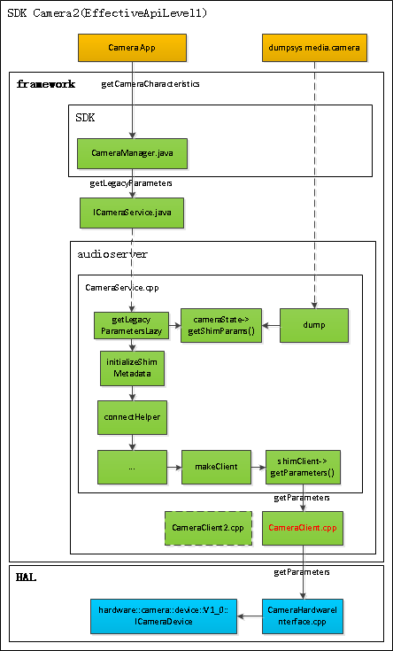
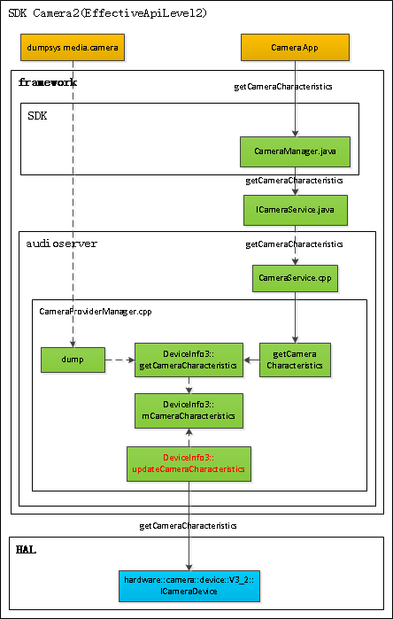
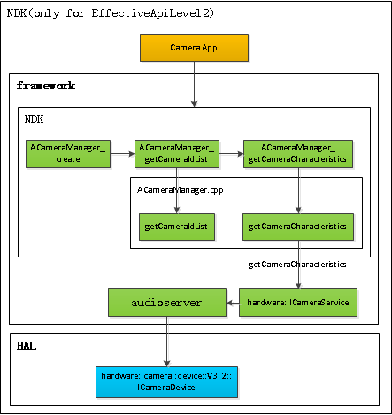

# Android Camera Framework修改笔记

## 适配第三方应用-强制使用横屏模式

* TODO

## 适配第三方应用-强制指定Camera的分辨率

* 出发点: VT6105(QC850)实现的Android接口(SDK/NDK)不完善,查询得到的Camera能力与实际不符(为固定内容),导致第三方应用(如腾讯会议,钉钉等)使用Android标准接口查询并打开Camera时使用了不支持的分辨率,从而没有画面. 所以修改目标: 使SDK/NDK接口返回实际支持的分辨率.

### 思路和尝试

* Android标准的Camera使用方法有: 
    * SDK camera1: 兼容性最好的接口,但是属于废弃的不推荐使用的接口
    * SDK camera2: 推荐使用的新接口,基本大部分系统和硬件都兼容性
    * NDK camera2: Android7.0以后才支持

* 尝试最快捷的方法: 考虑到兼容性,第三方应用大概率使用SDK camera2,直接修改获取Camera能力的返回值;但仍无效果,原因是第三方不是使用如下方法获取camera能力？

```
CameraManager cameraMgr = (CameraManager)gContext.getSystemService(Context.CAMERA_SERVICE);
CameraCharacteristics camCaps = cameraMgr.getCameraCharacteristics(cameraId);
StreamConfigurationMap configurationMap = camCaps.get(CameraCharacteristics.SCALER_STREAM_CONFIGURATION_MAP);

  /* 获取预览画面输出的尺寸，因为我使用TextureView作为预览 */
outSizes = configurationMap.getOutputSizes(SurfaceTexture.class);   // 修改framework,使getOutputSizes返回值为指定值
sizes = "";
for (Size outSize : outSizes)
    sizes += outSize + ",";
LogUtil.w("    Preview size: " + sizes);
```

* 由于上述方法失败,再加上腾讯会议APK反编译后没有找到相关JAVA/KOTLIN代码,只看到相关的SO库,所以猜测第三方应用使用了NDK接口;于是：
    * 参考google的[ndk sample](https://github.com/android/ndk-samples)中的camera示例
    * 将该部分代码集成到avalon的sample中，编译出单独的可执行程序：查询camera时，发现没有可用camera，怀疑是非android application，没有权限使用camera
    * 于是将ndk代码集成到libep3中，由tsx200应用触发查询，依然无法查询到camera
    * 再于是，下载google的ndk sample，直接编译apk测试（其中由于android studio版本和gradle版本问题，捣鼓升级半天）
    * google测试apk依然无法查询到camera，现在想来，才明白原因：原来vt6105只支持camera2-effectiveApiLevel1（即只实现了camera2-sdk的壳，并没有实际实现camera2的功能），所以不支持NDK接口
    * 此路不通

* SDK camera1：为什么没有尝试？因为通过`dumpsys media.camera`查看发现使用了version 2的接口？

* 上述方法失败后，只能继续研究sdk-camera2的接口
    * 于是在framework中不断添加打印日志，确定具体逻辑
    * 其中还走了弯路，没弄明白camera接口版本的历史变迁，以为用了sdk的camera2接口，就认为framework中都是走version 2的分支，后来才明白了类似NDK接口不支持的类似原因
    * 一开始仅修改CameraService的接口，SDK查询接口已经被修改，但是dumpsys和腾讯会议依然使用之前的能力
    * 然后追寻着dumpsys调用的dump接口的入口，修改了CameraClient的接口，dumpsys的结果已经被修改，但腾讯会议依然不正确
    * 多次尝试下，才发现当能力返回1080p和720p分辨率时，腾讯会议选择了720p，但输入源是1080p，所以依然失败(为什么轻颜APP可以打开？)，最后只设置能力为1080p，则腾讯会议能够打开camera

### 命令缓存

```
# 同步代码1
scp ./bin/cameraserver           tuyj@10.1.83.101:/home/tuyj/debug/tmp/ts5000/bin/
scp ./lib64/{libcamera2ndk.so,libcameraservice.so}     tuyj@10.1.83.101:/home/tuyj/debug/tmp/ts5000/lib64/
scp ./lib/{libcamera2ndk.so,libcameraservice.so}     tuyj@10.1.83.101:/home/tuyj/debug/tmp/ts5000/lib/

# 同步代码2
rsync -avrW  --progress -e 'ssh -p 22' /mnt/sanbu/android_source/ts5000/source/frameworks/av/services/camera/ tuyj@10.1.83.101:/home/tuyj/workspace/host_d/workspace/CodeDB/3rd-party/android/apq8096_o8.0_vt6105_release/frameworks/av/services/camera/
rsync -avrW  --progress -e 'ssh -p 22' tuyj@10.1.83.101:/home/tuyj/workspace/host_d/workspace/CodeDB/3rd-party/android/apq8096_o8.0_vt6105_release/frameworks/av/services/camera/ /mnt/sanbu/android_source/ts5000/source/frameworks/av/services/camera/ 

# 查找最近30分钟修改的文件
find . -mmin -30 |grep -v \.js |grep -v \.swf|grep -v \.ttf |grep -i camera |xargs ls -l

# CameraMetadataHelper使用
#include "CameraMetadataHelper.h"
static void printCameras(const char *prefix, CameraMetadata *characteristics) {
  ALOGW("3BU, %s printCameras", prefix);

  if (!characteristics) return;

  const camera_metadata_t* data = characteristics->getAndLock();
  if (!data) return;
  
  camera_metadata_t *buffer = clone_camera_metadata(data);
  CameraMetadataHelper *helper = new CameraMetadataHelper(buffer);
  helper->printAllTags();

  delete helper;
  characteristics->unlock(data);
}
printCameras("CameraProviderManager::getCameraCharacteristics", characteristics);
```

### 结论

* 达到预期目标,获取Camera能力逻辑梳理如下
* SDK camera1:

    TODO

* SDK camera2(legacy)：

    

* SDK camera2(really)：

    

* NDK camera2：

    
