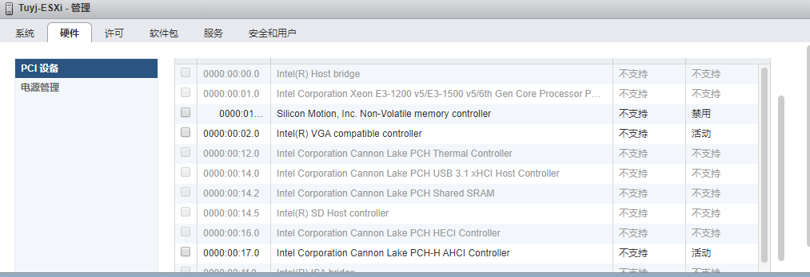
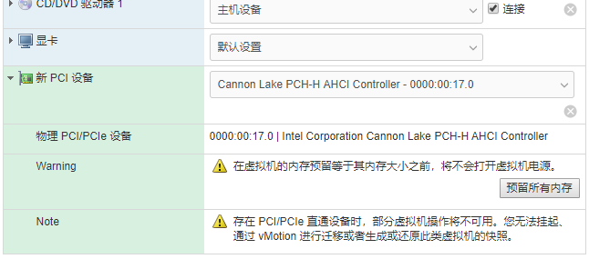
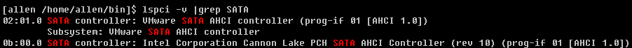
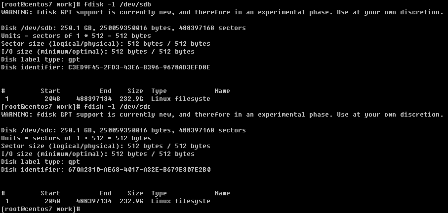
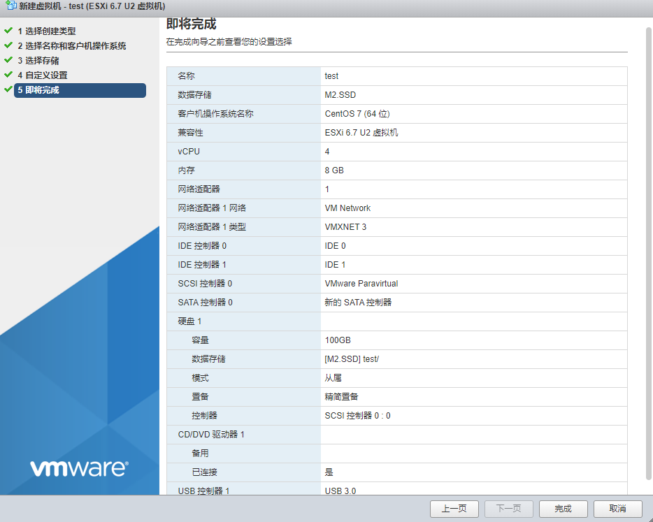

# 个人服务器搭建记录

## 1. 安装&配置ESXi

* [VMWare官网](https://www.vmware.com/products/esxi-and-esx.html)下载ISO(VMware-VMvisor-Installer-6.7.0.update03-14320388.x86_64.iso)
* UltraISO将ISO写入到U盘A中，作为安装盘
* 从U盘启动，根据安装向导将ESXi系统安装到U盘B中，作为系统盘
* 初次安装后通过直接控制台(TVUI)配置网络、开启SSH
* 修改ESXi Web（vSphere Web client）端口 @Deprecated
    * 由于现在路由器不支持端口映射，外网若想访问ESXi，要开放80/443端口，出于安全考虑，需要修改端口号；
    * 参考[官方文档](https://kb.vmware.com/s/article/1021199?lang=zh_CN)（另[端口使用表](https://kb.vmware.com/s/article/1012382)）和[其他参考](https://www.cnblogs.com/hitaoge/p/11158225.html)
        * 修改 /etc/vmware/rhttpproxy/config.xml 中httpPort和httpsPort
        * 按需修改防火墙策略：/etc/vmware/firewall/service.xml 修改80/443端口
    * 按照如上修改，却影响了esxcli（vSphere client）使用（报错连接拒绝），没有继续研究如何同步修改esxcli使用端口（按照官方文档中修改vSphere client端口的思路应该可以走通）
* SSH端口修改，原因同上 @Deprecated
    * 参考[官方文档](https://kb.vmware.com/s/article/2011818?lang=zh_CN)
    * 出于安全考虑，最终放弃向公网暴露SSH连接
* 关闭防火墙，[参考](https://www.kkpan.com/article/2475.html)，出于安全考虑，并没有操作 @Deprecated
* ESXi默认配置已经足够稳定，小白修改反而增加不可控因素，所以等更换路由器后会把WEB和SSH端口还原
* 新建存储设备
    * ESXi Web -> 存储 -> 新建数据存储 -> VMFS格式 -> 选择SSD磁盘；若SATA盘须直通到虚拟机中，不要将其格式化为ESXi的磁盘
* **配置硬件直通**
    * 开启直通: ESXi Web -> 主机 -> 管理 -> 硬件 -> PCI设备 -> 切换直通
    * 创建虚拟机时添加其他PCI设备,虚拟机安装好后,系统中就能直接看到该PCI设备
    * ESXi 6.7U3默认不支持直通SATA控制器，需要后台修改配置才能启用（6.7.0似乎不支持如此操作）
        ``` ESXi-Shell
        [root ~]$ lspci -v | grep AHCI
        0000:00:1f.2 SATAcontroller Mass storage controller: Intel Corporation Lynx Point AHCIController [vmhba0]
         Class 0106: 8086:8c02
        [root ~]$ echo "#Intel Corporation Lynx Point AHCI Controller" >> /etc/vmware/passthru.map
        # 其中8086 8c02为lspci查出的品牌、型号？d3d0为固定的设备类型？
        [root ~]$ echo "8086 8c02 d3d0 false" >> /etc/vmware/passthru.map
        [root ~]$ reboot
        ```
    * 效果如下
    
    
    
    
* 创建虚拟机
    * 具体参数参见
    
    * 注意，添加PCI直通设备后，虚拟机的内存预留必现等于设定的最大内存
    * 若虚拟机系统带图形界面,须手动指定显卡参数（<默认设置>可能导致系统无法启动）

## 2. 安装&配置CentOS7

* 配置网络
    * 可以通过图形界面修改IP/DNS/Route
    * 也可以修改配置文件 `/etc/resolv.conf` 和 `/etc/sysconfig/network-scripts/ifcfg-enXXX`
* 关闭防火墙和SELinux
    * `firewall-cmd --state` 或 `systemctl status firewalld` 查看状态
    * 通过`systemctl start/stop/disable firewalld`控制防火墙状态
    * `getenforce`获取SELinux状态，通过`setenforce 0`临时关闭, 修改`/etc/selinux/config`永久关闭
    * CentOS 7默认没有安装iptables
* sudoers配置
    * 可以修改`/etc/sudoers`，但更推荐通过命令`visudo`来修改配置
    * 通过`sudo -l`获取当前用户的sudo权限
    * 可以直接在sudoers文件中添加权限，也可以单独写到`/etc/sudoers.d/`下（打开sudoers中`#includedir /etc/sudoers.d`,一个'#'表示打开）
    * 可以参考root用户放开所有权限，也可以参考下面配置使用户获取指定权限且无须密码：
    ```shell
    # allen用户名可以换成%group_name
    allen   ALL=(ALL)NOPASSWD: /usr/bin/yum, \
            /bin/vim /var/log/secure
    ```
* 配置yum源
    * 使用阿里源替代默认yum源
    ```shell
    cd /etc/yum.repos.d/
    wget http://mirrors.aliyun.com/repo/Centos-7.repo
    mv CentOS-Base.repo CentOS-Base.repo.ori
    mv Centos-7.repo Centos-7-aliyun.repo
    ln -s Centos-7-aliyun.repo CentOS-Base.repo
    yum clean all
    yum makecache
    yum update
    ```
    * 添加yum源: *待补充*
* SSH端口修改
    * root权限修改`/etc/ssh/sshd_config`中`Port 22`
    * 建议先在`Port 22`之后加一行新端口,测试通过后删除默认端口
    * 重启sshd后生效: `systemctl restart sshd`
* 常用系统日志
    * `/var/log/cron` 定时任务日志
    * `/var/log/secure` 安全相关的日志(如SSH登录等)
* 磁盘添加和挂载
    * `smartctl --all /dev/sdb`可以查看磁盘S.M.A.R.T信息，smartctl为centos自带工具，也可以通过`yum install smartmontools`安装
    * 分区、格式化、创建文件系统、挂载
    ```shell
    # 创建分区
    fdisk /dev/sdb  # 对sdb分区
        -> p        # 查看磁盘信息
        -> n        # 新建分区
        -> 1        # 分区编号(对应sdb1)
        ->          # 若整块磁盘分1个区，起始扇区和结束扇区都用默认值
        -> w        # 保存执行分区
    
    # 格式化和创建文件系统
    # xfs为较新的文件系统类型,效率更高; 使用mkfs.xfs创建文件系统未生效
    mkfs -t xfs /dev/sdb1
    
    # 手动测试挂载
    mkdir /mnt/hhd_Hitachi
    mount /dev/sdb1 /mnt/hhd_Hitachi
    
    # 配置启动自动挂载
    # /etc/fstab中添加如下
    /dev/sdb1 /mnt/hhd_Hitachi xfs defaults 0 0
    # 第四列挂载参数可以是如下值
    #   defaults: rw, suid, dev, exec, auto, nouser, and async.
    #   auto/noauto 自动挂载
    #   nouser 只有超级用户可以挂载
    #   ro 按只读权限挂载
    #   rw 按可读可写权限挂载
    #   user 任何用户都可以挂载
    ```
* 启动NFS
    具体参见<NFS配置>文档

## 3. 配置外网访问

### . 公网IP和域名绑定
* 注册免费域名;略

### . DDNS
* 略
* 配置DDNS
    * freenom注册免费顶级域名
    * 下载开源DDNS
    * aliyun、dnspod尝试，最后选择cloudflare
        * 注册账号，创建api token
        * cloudflare上添加site
        * 注册商freenom填写cloudflare dns导入地址
    * 修改crontab任务


## 5. 计划
* 搭建翻墙工具
* 搭建公司反向代理
* 搭建Gitlab
* 个人云相册
* PKM git/markdown化