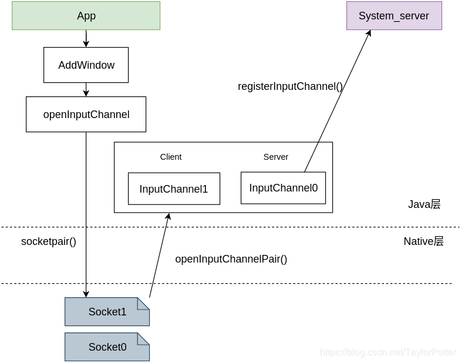
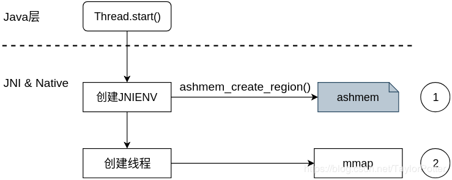

## 关键词

* 文件描述符太多
* Too many open files
* fd leak

## 查看

* 查看进程打开的文件数

`lsof -p <PID>`

* 统计数量

`lsof -p <PID> | wc -l`

* 查看系统的限制

`ulimit -a`

* 查看进程的限制

`cat /proc/<pid>/limits`

## 常见可能

* 如果存在大量的用户文件被打开，可能open或BufferedReader打开后没有close

* 大量 eventpoll/eventfd/pipe，通常情况下是开启了太多的HandlerThread/Looper/MessageQueue, 线程忘记关闭, 或者looper 没有释放. 可以用android studio profiler抓取cpu执行trace分析线程情况

* 对于system server, 如果有大批量的socket 打开, 可能是因为Input Channel（input事件） 没有关闭, 查看system server 中WindowState 的情况或者执行adb shell dumpsys window查看或者生成hprof分析

* 大批量的打开“/dev/ashmem”
    * 有可能是java thread 没有正常关闭，如下图，一个thread创建JNIENV时需要打开/dev/ashmem；
        
    * 也有可能时创建过多的surface（和surfaceflinger通过ashmem传递数据）也会增加/dev/ashmem，常常伴随socket增加
    * 还有可能数据库打开后没有关闭：sqlite的CursorWindow就是共享内存的抽象，数据实际存放在native层中
    * 还可能Bitmap IPC引起的，详细[参考](https://blog.csdn.net/TaylorPotter/article/details/83615163)

## 辅助工具

* android studio profiler 抓取调用栈,对比增加前后
* dumpsys window
* 生成hprof对比