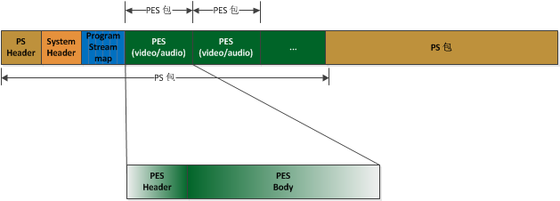
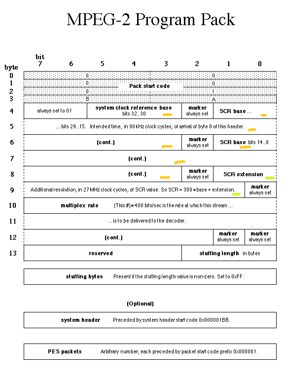
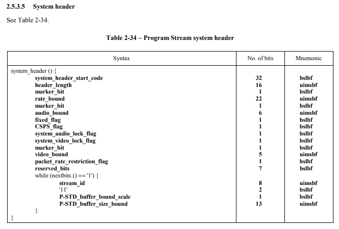
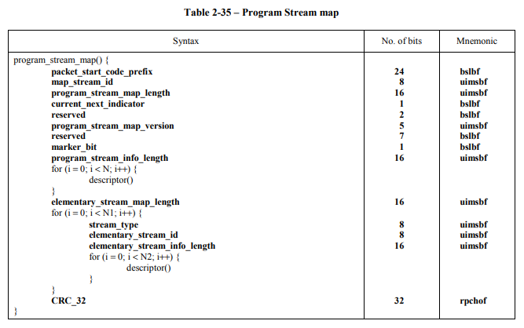
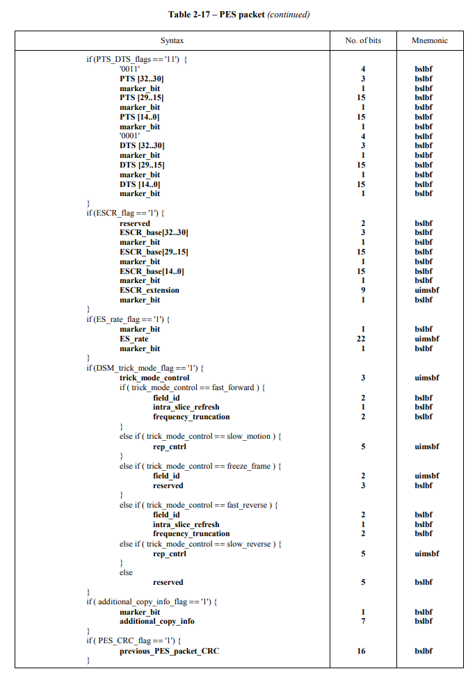
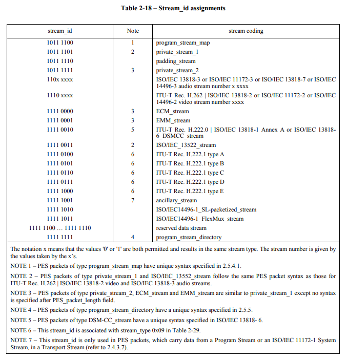

* GB28181:
    * PS封装遵循：ISO/IEC 13818-1:2000
    * ps over rtp: payload-type=96
    * 每个视频帧存至一个PS包

* 可视化分析工具：Elecard StreamEye Tools\SAnalyzer.exe

* ps包:
    * 首条数据/每个关键帧结构：PS Header + PS System Header + PSM + PESV（Header + Payload）* n
    * 非首条数据结构：PS Header + PESV（Header + Payload）* n

    

* PS Header(Pack Header)
    * 描述：？
    * e.g.: `<S4:00 00 01 ba> <B9:44 00 04 00 04 01 86 66 cf> <L1:f8>`
    * S4: 以`00 00 01 ba`开始；
    * B9: 接9个字节的body；
        * 系统时钟参考字段，单位90 kHz
            * SCR base：如下图橙色标记，占33位
            * SCR extenstion：如下图绿色标记，占9位
        * Multiplex rate：占33位，指出了系统目标解码器接收PES分组的速率，单位：400位/秒
    * L1: 第10个字节后三位表示后续扩展字段长度

    

* PS System Header
    * 描述：PS System参数、后续码流P-STD buffer参数
    * e.g.: `<S4:00 00 01 bb> <L2:00 0c> <F6:81 86 a1 05 e1 7f> <S3:<I1:e0> e8 00> <S3:<I1:c0> c1 00>`
    * S4: 以`00 00 01 bb`开始；
    * L2: 紧接2个字节表示，表示该header后续的长度
    * F6: 紧接6个字节表示各种flag
    * S3: 然后每3个字节表示一路流的信息
        * 其中I1: 第一个字节为`stream_id`(0xE0视频，0xC0音频)

    

* PSM(PS Map)
    * 描述：PSM信息、码流编码信息；
    * e.g.: `<S4:00 00 01 bc> <L2:00 12> e0 ff 00 00 00 08 <M2:1b e0> 00 00 <M2:90 c0> 00 00 fe df b1 d7`
    * S4: 以`00 00 01 bc`开始
    * L2: 2字节表示该header后续长度
    * M2: 为`stream_type`和`stream_id`的映射关系，如下例：
        * `1b e0`：表示后续视频流(`e0`)为H264码流(`1b`)
        * `90 c0`：表示后续音频流(`c0`)为G711码流(`90`)
        
    

* PES(Packetized Elementary Streams)
    * 描述：ES的打包信息(时间戳等)、ES码流
    * e.g.: `<S4:00 00 01 e0> <L2:07 c2> <F1:80> <P1:c1> <L1:0e> 31 00 03 8e 71 11 00 03 5f 91 10 60 e6 ff `
    * S4: 以`00 00 01` + `stream_id`开始
    * L2: 2个字节长度信息，表示该PES后续包的长度
    * F1: `0x80`=`10 00 0 0 0 0`,右第六位为`data_alignment_indicator`，1表示一帧媒体数据超出了PES长度，需要多PES分包，0表示不分包。
    * P1: 该字节的前2位为`PTS_DTS_FLAGs`：
        '10'：PES头后续包含PTS
        '11'：PES头后续包含PTS、DTS
        '00'：PES头后续不包含PTS、DTS
        '01'：不允许
    * L1: 该字节为`PES_header_data_length`，表示后续头部，到媒体数据之前的长度

    

    

* stream_id
    * VALUE & 0xF0 == 0xE0，表示视频流；即1110 xxxx可以用后4位来表示子类型；一般后4位为0
    * VALUE & 0xE0 == 0xC0，表示音频流；即110x xxxx可以用后5位来表示子类型；一般后5位为0
    * VALUE == 0xBC，表示PSM

    

* stream_type
    * 0x10: MPEG-4视频流
    * 0x1B: H.264视频流
    * 0x24：H265/HEVC
    * 0x80: SVAC视频流
    * 0x90: G.711音频流
    * 0x92: G.722.1音频流
    * 0x93: G.723.1音频流
    * 0x99: G.729音频流
    * 0x9B: SVAC音频流

* 其他非标准头
    * `00 00 01 bd`这个是海康私有流的标识，可以丢弃。丢弃之后就看不到原视频里移动侦测时闪烁的红框。
    * `00 00 01 bf`也是海康的私有数据，可[参考](https://www.cnblogs.com/heiche/p/6895306.html)

* 参考
    * https://blog.csdn.net/chenxijie1985/article/details/118890318

* 怀疑点
    * ~~H264/265取码流错误：添加了错误的SPS/PPS~~ -> 改正后裸码流能直接播放，但是联调依然未通
    * ~~payload type不一致~~ -> 改正后依然未通
    * RTP封包不正确？似乎没有mark标记 ffmpeg有
    * ~~PS封包格式不正确？PESV长度出现ffff？~~ -> 大致分析了PS格式，似乎没问题；dump ps流，vlc/ffmpeg/ffprop/eys都能解析
    * ~~码流00 00 00 01 65变成了00 00 01 65？~~ -> ffmpeg也是如此

1、视频数据的pes分包

PES头中PES_packet_length是一个16位的长度，当数据一个pes包放不下时，海康使用data_alignment_indicator标志位，该位置1时，表明是起始PES包，如果置0则表示是分包数据，需要做好数据拼接

* psparser