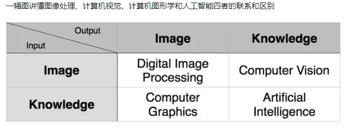
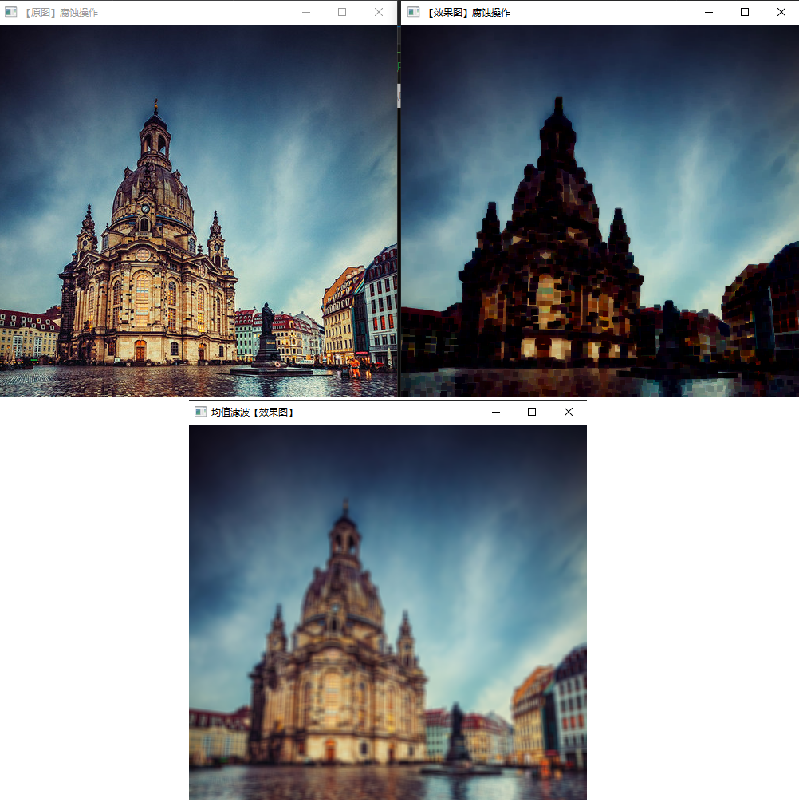
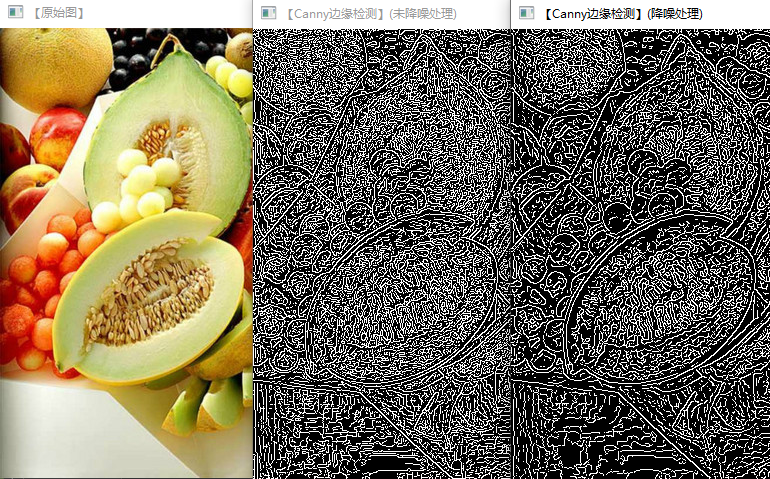
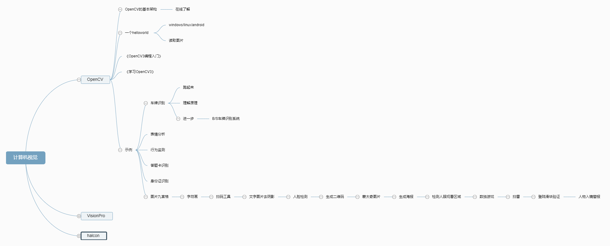

# 计算机视觉概要



## OpenCV 简述

* Open Source Computer Vision Library，开源的计算机视觉库

* 它提供了很多函数，这些函数非常高效地实现了计算机视觉算法（最基本的滤波到高级的物体检测皆有涵盖）。

* 应用广泛，包括图像拼接、图像降噪、产品质检、人机交互、人脸识别、动作识别、动作跟踪、无人驾驶等。

* 还提供了机器学习模块(MML，Machine Learning Library)，你可以使用正态贝叶斯、K最近邻、支持向量机、决策树、随机森林、人工神经网络等机器学习算法。

## 各版本

* v2.0(v2.4.x)
    * 全新C++接口；
    * 支持IOS、Android平台；
    * 通过CUDA、OpenCL实现GPU加速；
    * 提供Python、Java提供接口支持
    * 支持Github、Buildbot作为持续集成系统

* v3.0
    * 修改项目架构：整体构建 -> 内核+插件架构
        * opencv：主仓库，稳定
        * opencv_extra
        * opencv_contrib: （contributed/experimental）不太稳定的实验性功能：新型脸部识别、文本探测、文本识别、新的边缘检测器、图像修复、深度地图处理、新的光流和追踪算法。

## v3.x SDK说明

* `include\opencv` 为v1.0保留下来的核心组件
* `include\opencv2` 为v2.0开始的组件(v3.0头文件基本不变)
    * `opencv_modules.hpp` 描述了启用哪些模块
    * `core`：核心模块，包含：
        * 基本数据结构
        * 动态数据结构
        * 绘图函数
        * 数组操作相关函数
        * 辅助功能与系统函数和宏
        * 与OpenGL的互操作
    * `imgproc`：image process，图像处理模块，包含：
        * 线性和非线性的图像滤波
        * 图像的几何变换
        * 其他(miscellaneous)图像转换
        * 直方图相关
        * 结构分析和形状描述
        * 运动分析和对象跟踪
        * 特征检测
        * 目标检测
    * `features2d`：2D功能框架，包含：
        * 特征检测和描述
        * 特征检测器(Feature Detectors)通用接口
        * 描述符提取器(Descriptor Extractors)通用接口
        * 描述符匹配器(Descriptor Matchers)通用接口
        * 通用描述符匹配器(Generic Descriptor Matchers)通用接口
        * 关键点绘制函数和匹配功能绘制函数
    * `calib3d`：相机校准(calibration)和3D建模相关，包括但不限于：
        * 基本的多视角几何算法
        * 单个立体摄像头标定
        * 物体姿态估计
        * 立体相似性算法
        * 3D信息重建
    * `flann`: fast library for approximate nearest neighbors，高维的近似最近邻快速搜索算法库，包含：
        * 近似最近邻快速搜索
        * 聚类
    * `highgui`：高层GUI，包含媒体的输入输出、视频捕捉、图像和视频的编解码、GUI等
    * `ml`：machine learning，机器学习模块（统计模型和分类算法），包含：
        * 统计模型 (statistical models)
        * 一般贝叶斯分类器 (normal Bayes classifier)，基于统计模型和分类算法
        * K-近邻 (K-Nearest Neighbors)，基于统计模型
        * 支持向量机 (SVM，Support Vector Machines)，基于统计模型
        * 期望最大化 (Expectation Maximization algorithm)，基于统计模型
        * 决策树 (decision tree)，基于统计模型
        * 随机树 (random tree)，基于决策树
        * 提升 (Boost)，基于决策树和分类算法
        * 人工神经网络（ANN_MLP,Artificial Neural Networks - Multi-Layer Perceptrons）和MLData
        * 逻辑回归分类器（Logistic Regression classifier），基于统计模型和分类算法
        * 随机梯度下降支持向量机分类器（Stochastic Gradient Descent SVM classifier），基于统计模型和分类算法
        * 梯度提高树 (Gradient Boosted Trees) ?
        * 超随机树 () ?
    * `objdetect`：目标检测模块，包含级联分类器（Cascade Classifier）和Latent SVM
    * `core/ocl`：运用OpenCL加速的模块
    * `photo`：computational photography， 包含图像修复和图像去噪两部分
    * `stitching`：images stitching，图像拼接模块，包含：
        * 拼接流水线
        * 特点寻找和匹配图像
        * 估计旋转
        * 自动校准
        * 图片歪斜
        * 接缝估测
        * 曝光补偿
        * 图片混合
    * `superres`：SuperResolution，超分辨率技术相关模块
    * `video`：视频分析模块，包含：运动估计、背景分离、对象跟踪等视频处理相关内容
    * `videostab`：video stabilization，视频稳定相关模块
    * `dnn`：Deep Neural Networks，深度神经网络
    * `imgcodecs`：图片编解码？
    * `shape`：形状？
    * `videoio`：视频IO？
    * `gpu`？：运用GPU加速的模块
    * `nonfree`？：非免费算法
    * `legacy`？：已废弃的代码库，用于向下兼容，包含：
        * 运动分析
        * 期望最大化
        * 直方图
        * 平面细分(C API)
        * 特征检测和描述（Feature Detection and Description）
        * 描述符提取器(Descriptor Extractors)通用接口
        * 通用描述符匹配器(Generic Descriptor Matchers)通用接口
        * 匹配器

## v3.x 示例和教程

* `<source-dir>\samples\` 为官方示例代码，有按平台划分、场景划分等
* `<source-dir>\samples\cpp` 为v2.x/3.x的主要示例
* `<source-dir>\samples\cpp\tutorial_code\` 为官方配套教程的示例代码；按照模块划分

## 常用基本操作

### 图像读取、存储、输出

* `InputArray`或`OutputArray`封装类可用于保存图像或其他矩阵数据
    * `Mat`类是其中一种常用的实际类型
    * 还有`cuda::GpuMat`、`ogl::Buffer`等类型

* `Mat`类既是图像容器类，也是个通用矩阵类
    * 内部分为矩阵头和矩阵数据，该类赋值运算、拷贝构造操作只是`构造矩阵头+引用矩阵数据`，须通过`copyTo`或`clone`函数才能实际复制矩阵数据
    * 构造和初始化见<OpenCV3编程入门-4.1.4>
    * 可是使用`randu`函数产生随机数填充矩阵
    * `Vec`是`Matx<_Tp, cn, 1>`的派生类，即一维矩阵，和std::vector类似
    * `Scalar`是`Vec<_Tp, 4>`的派生类，即有4个元素的数组/一维矩阵

* `imread`函数：读取图像；`flags`参数说明：
    * int型，但有效取值为-255~255
    * IMREAD_GRAYSCALE: 转换为单通道的灰度图
    * IMREAD_COLOR: 三通道的`BGR`彩色图
    * IMREAD_ANYDEPTH: 如果为16-bit/32-bit深度则返回相应深度的图像,否则范围8位图
    * 若多个值冲突，则采用较小值，比如0xff(1111B),则取值为`1`
    * 无损原图: IMREAD_ANYDEPTH | IMREAD_ANYCOLOR
    * 默认不返回alpha通道，若需要则取负值

* `imshow`函数：输出图像

* `putText`函数：文字叠加

### 图像处理

* `erode`函数，腐蚀操作：图像中暗色部分"腐蚀"亮色部分

* `blur`函数，模糊操作: 均值滤波操作

    

* `canny`函数，边缘检测: 原图->灰度图->降噪(模糊)->canny

    

### 视频处理

* `VideoCapture`：可以从媒体文件或者摄像头读取视频frame
    ```C++
    VideoCapture capture("1.avi"); // from file
    VideoCapture capture(0);       // from camera
    ```

## 更多操作

* 颜色空间缩减：见<OpenCV3编程入门-5.12>、<opencv_learning-5.1_color_space_reduction>、<opencv_learning-5.2_14WaysToAccessPixel-第14种运算符重载>

* 计时：见<OpenCV3编程入门-5.14>

* 更多参见<OpenCV3编程入门>批注和<opencv_learning>演示程序

* 学习路径
    