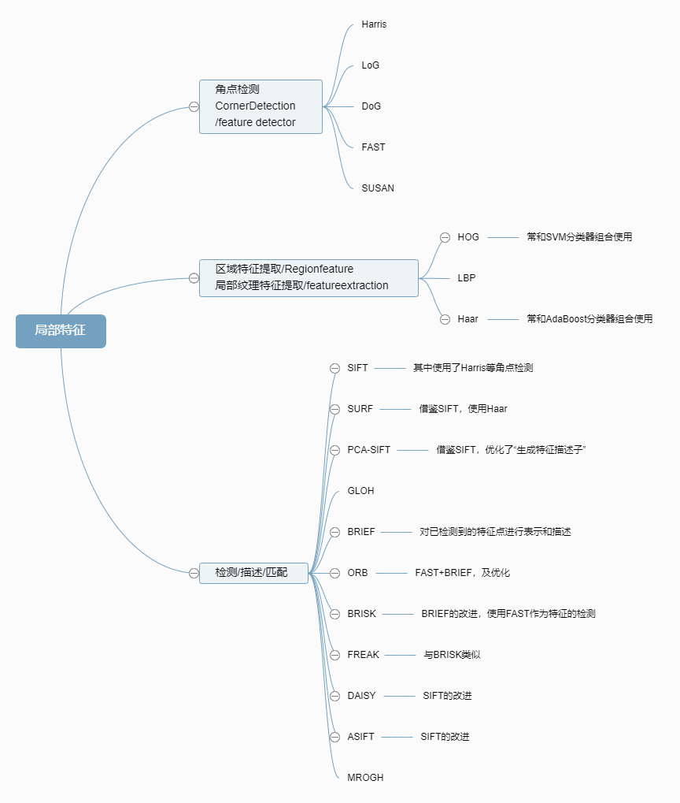
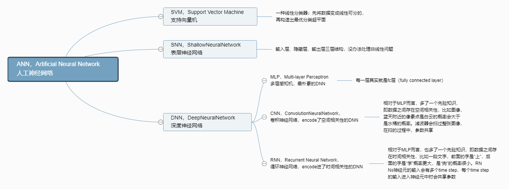

# OpenCV特征训练与识别

## 图像特征分析概述

* 局部图像特征描述的核心问题是不变性（鲁棒性）和可区分性

* 视觉领域的顶级会议ICCV/CVPR/ECCV；每年都发表高质量的特征描述论文

* `角点检测`，Corner Detection，也称为特征点检测，是获取图像局部特征点的一类方法，广泛应用于运动检测、图像匹配、视频跟踪、三维建模以及目标识别等领域中。

* `SIFT`，尺度不变特征变换(Scale-invariant feature transform)，一种检测、描述和匹配图像局部特征点的方法：通过在不同的尺度空间中检测极值点或特征点(Conrner Point, Interest Point)，提取出其位置、尺度和旋转不变量，并生成特征描述子，最后用于图像的特征点匹配。应用最广的，它在1999年首次提出，至2004年得到完善。其实时性较差。四步：尺度空间构建，关键点定位，主方向分配，生成特征描述子

* `SURF`,（Speeded Up Robust Features）加速鲁棒特征，是对SIFT的改进版本，它利用Haar小波来近似SIFT方法中的梯度操作，同时利用积分图技术进行快速计算，SURF的速度是SIFT的3-7倍，大部分情况下它和SIFT的性能相当，因此它在很多应用中得到了应用，尤其是对运行时间要求高的场合。

* `PCA-SIFT和GLOH`，(Gradient Location-Orientation Histogram)，也是SIFT变种

* `DAISY`,是面向稠密特征提取的可快速计算的局部图像特征描述子，它本质思想和SIFT是一样的：分块统计梯度方向直方图，不同的是，DAISY在分块策略上进行了改进，利用高斯卷积来进行梯度方向直方图的分块汇聚，这样利用高斯卷积的可快速计算性就可以快速稠密地进行特征描述子的提取。

* `ASIFT`,（Affine SIFT）通过模拟所有成像视角下得到的图像进行特征匹配，可以很好地处理视角变化的情况，尤其是大视角变化下的图像匹配。

* `MROGH`,（Multi-support Region Order-based Gradient Histogram）则是特征汇聚策略上寻求创新，之前的局部图像特征描述子，其特征汇聚策略都是基于邻域内点的几何位置的，而MROGH基于点的灰度序进行特征汇聚。

* `BRIEF`,（Binary Robust Independent Element Feature）利用局部图像邻域内随机点对的灰度大小关系来建立局部图像特征描述子，得到的二值特征描述子不仅匹配速度快，而且存储要求内存低，因此手机应用中具有很好的应用前景。

* `ORB`，(Oriented FAST and Rotated BRIEF)算法是对FAST特征点检测和BRIEF特征描述子的一种结合，在原有的基础上做了改进与优化，使得ORB特征具备多种局部不变性，并为实时计算提供了可能

* `BRISK`,(Binary Robust Invariant Scalable Keypoints)是BRIEF算法的一种改进，也是一种基于二进制编码的特征描述子，而且对噪声鲁棒，具有尺度不变性和旋转不变性。利用FAST算法进行特征点检测，为了满足尺度不变性，BRISK构造图像金字塔在多尺度空间检测特征点。

* `FREAK`, Fast Retina Keypoint，与ORB、BRISK算法类似，也是一种基于二进制编码的图像特征描述子，受到人眼视网膜视觉机理的启发而提出

* `PCA-SIFT，Linear Discriminative Embedding，LDA-Hash`，都是通过机器学习训练出来的特征描述子

* `SUSAN`，(Small univalue segment assimilating nucleus)是一种基于灰度图像以及窗口模板的特征点获取方法，适用于图像中**边缘和角点的检测**，对噪声鲁棒，而且具有简单、有效、计算速度快等特点。

* `FAST`，(Features From Accelerated Segment Test)在进行**角点检测**时，计算速度更快，实时性更好

* `LoG和DoG`，(Laplacian of Gaussian) 和(Difference of Gaussian)算子是图像处理中实现**极值点检测**(Blob Detection)的两种方法。通过利用高斯函数卷积操作进行尺度变换，可以在不同的尺度空间检测到关键点(Key Point)或兴趣点(Interest Point)，实现尺度不变性(Scale invariance)的特征点检测。

* `Harris`，是基于**角点**的特征描述子，属于feature detector，主要用于图像特征点的匹配(match)，在SIFT算法中就有用到此类角点特征

* `Haar特征`：是一种用于目标检测或识别的图像特征描述子，Haar特征通常和AdaBoost分类器组合使用，而且由于Haar特征提取的实时性以及AdaBoost分类的准确率，使其成为人脸检测以及识别领域较为经典的算法。详述[参见](https://senitco.github.io/2017/06/15/image-feature-haar/); 更多[图像特征提取](https://senitco.github.io/categories/Algorithm/)

* `HOG`，Histogram of Oriented Gradient（方向梯度直方图特征），是一种物体检测的特征描述子：它通过计算和统计图像局部区域的梯度方向直方图来构成特征。Hog特征结合SVM分类器已经被广泛应用于图像识别中，尤其在行人检测中

* `LBP`，Local Binary Patter（局部二值模式），是一种用来描述图像局部纹理特征的算子：它将图像中的各个像素与其邻域像素值进行比较，将结果保存为二进制数，并将得到的二进制比特串作为中心像素的编码值，也就是LBP特征值。LBP提供了一种衡量像素间邻域关系的特征模式，因此可以有效地提取图像的局部特征，而且由于其计算简单，可用于基于纹理分类的实时应用场景，例如目标检测、人脸识别等。

* 图像特征提取关系
    

* 人工神经网络分类
    
