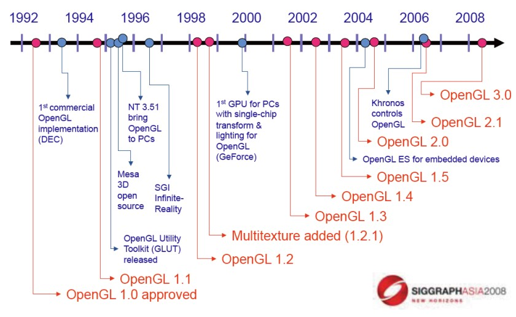
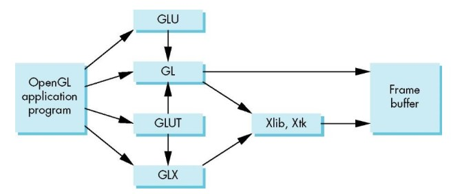
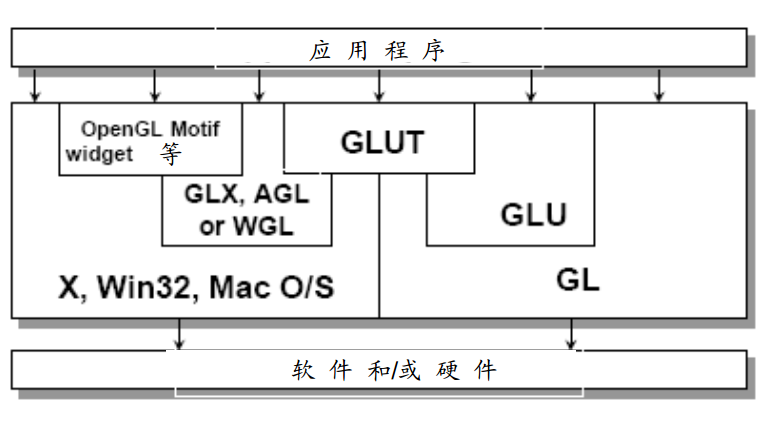
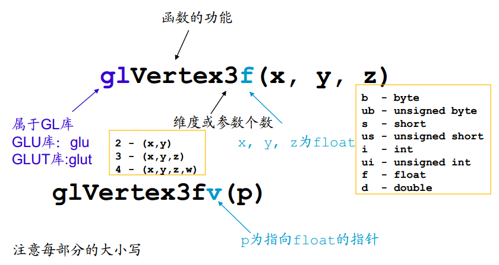
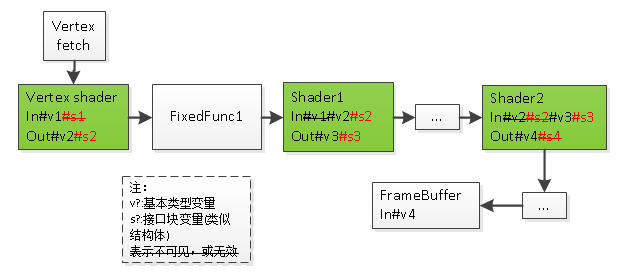

<!-- TOC -->

- [学习计划](#%E5%AD%A6%E4%B9%A0%E8%AE%A1%E5%88%92)
- [简述](#%E7%AE%80%E8%BF%B0)
- [API架构](#api%E6%9E%B6%E6%9E%84)
- [基本概念](#%E5%9F%BA%E6%9C%AC%E6%A6%82%E5%BF%B5)
- [渲染管线](#%E6%B8%B2%E6%9F%93%E7%AE%A1%E7%BA%BF)
    - [OpenGL](#opengl)
    - [OpenGL ES](#opengl-es)
    - [管线各阶段间的数据传递](#%E7%AE%A1%E7%BA%BF%E5%90%84%E9%98%B6%E6%AE%B5%E9%97%B4%E7%9A%84%E6%95%B0%E6%8D%AE%E4%BC%A0%E9%80%92)
- [变量和内置变量](#%E5%8F%98%E9%87%8F%E5%92%8C%E5%86%85%E7%BD%AE%E5%8F%98%E9%87%8F)
    - [顶点属性attribute](#%E9%A1%B6%E7%82%B9%E5%B1%9E%E6%80%A7attribute)
    - [一致变量uniform](#%E4%B8%80%E8%87%B4%E5%8F%98%E9%87%8Funiform)
    - [易变变量varying](#%E6%98%93%E5%8F%98%E5%8F%98%E9%87%8Fvarying)
    - [常量const](#%E5%B8%B8%E9%87%8Fconst)
- [顶点处理](#%E9%A1%B6%E7%82%B9%E5%A4%84%E7%90%86)
    - [基本流程](#%E5%9F%BA%E6%9C%AC%E6%B5%81%E7%A8%8B)
    - [常用函数](#%E5%B8%B8%E7%94%A8%E5%87%BD%E6%95%B0)
    - [示例](#%E7%A4%BA%E4%BE%8B)
- [细分曲面](#%E7%BB%86%E5%88%86%E6%9B%B2%E9%9D%A2)
- [坐标系](#%E5%9D%90%E6%A0%87%E7%B3%BB)
- [附录1-内置一致变量清单](#%E9%99%84%E5%BD%951-%E5%86%85%E7%BD%AE%E4%B8%80%E8%87%B4%E5%8F%98%E9%87%8F%E6%B8%85%E5%8D%95)
- [附录2-示例清单](#%E9%99%84%E5%BD%952-%E7%A4%BA%E4%BE%8B%E6%B8%85%E5%8D%95)
    - [VertexShader蓝宝书](#vertexshader%E8%93%9D%E5%AE%9D%E4%B9%A6)

<!-- /TOC -->

# 学习计划

* 学习资料
    * 蓝宝书：《OpenGL超级宝典》
    * 红宝书ES版：《OpenGL ES 3.0编程指南》
    * [LearnOpenGL CN](https://learnopengl-cn.github.io/) ([LearnOpenGL](https://learnopengl.com/))
    * [OpenGL from 思密达](http://www.songho.ca/opengl/index.html)
    * [OpenGL Wiki](https://www.khronos.org/opengl/wiki/)

* 目标和路径
    * 基本
        * **了解**计算机图形编程和OpenGL开发原理和流程
            * 《OpenGL Wiki：管线》
            * 《蓝宝书： 第三章 管线》
            * 《红宝书ES版： 第2章 你好，三角形》
            * 《LearnOpenGL CN： 你好，三角形》
        * **掌握**Android OpenGL ES 视频合成的完整流程和细节
            * 《OpenGL from 思密达》
        * **解决**Avalon VideoEngine自定义shader渲染时，因为缺失source texture而报错的问题
        * 使用OpenGL能**独立编写**一个2D、旋转、移动并弹壁的、变色的三角形（Windows&Android）
            * 《LearnOpenGL CN》
    * 更高
        * 完成LearnOpenGL的2D演示游戏
        * 优化Avalon VideoEngine，提升性能
        * Avalon VideoEngine支持美颜、滤镜等功能
    
# 简述

* OpenGL发展史

    

* OpenGL vs Direct3D

    |OpenGL|Direct3D|
    |-|-|
    |可扩展机制:跨平台的可移植的开放式标准API|一致性好:Windows平台的专利API|
    |底层实现（驱动）管理硬件:可硬件加速的3D渲染系统|应用程序管理硬件资源:3D硬件接口|
    |专业图形应用、 科研|高性能硬件存取能力:计算机游戏|
    |适合图形学教学|Direct3D 7.0能匹敌，8.0 （2001）开始胜出|

* OpenGL ES（embedded system），应用于手持和嵌入式设备的OpenGL API

* 早期的OpenGL使用**立即渲染模式**（Immediate mode，也就是固定渲染管线）
    * 容易使用和理解，但是效率太低

* OpenGL3.2开始，规范文档开始废弃立即渲染模式,鼓励使用**核心模式**(Core-profile)
    * 核心模式有一些难度，然而提供了更多的灵活性，更高的效率

# API架构

* 库
    * GL，OpenGL Core Library
        * 函数名gl开头
        * Windows: WINDOWS\SYSTEM32\opengl32.dll；Direct3D的封装，需安装驱动来实现硬件加速
        * 大多数Unix/Linux系统： libGL.a
    * GLU，OpenGL Utility Library
        * 函数名glu开头
        * Windows: WINDOWS\SYSTEM32\glu32.dll
        * 基于GL的封装，提供一些通用功能：二次曲面、 NURBS、多边形网格化等
    * GLUT，OpenGL Utility Toolkit Library
        * 函数名glut开头
        * 为保证代码的可移植性，抽象了各平台窗口系统的通用功能：创建窗口,鼠键输入,菜单,事件驱动等
        * 但缺乏一些现代GUI的控件和功能：滚动条等。*（可用FLTK、 SDL解决？）*
        * 该原生库已经停止支持20年，可以使用freeGLUT
    * 窗口粘合库，粘合OpenGL和窗口系统
        * GLX：X Window系统
        * WGL：Windows
        * AGL：Macintosh
    * EGL，是OpenGL API和原生窗口系统之间的接口（中间件）
    
* 库关系

    

    

* 常量与数据类型

    * gl.h, glu.h和glut.h中定义大量的常量，例如：GL_DEPTH_TEST，GL_COLOR_BUFFER_BIT

    * 这些头文件中还包含了GLfloat, GLdouble等数据类型

* 函数

    * 命名规则
        
        

    * 定义图元类函数(what)
        * 图元函数(primitive)，定义基本的低级的对象：点、线段、多边形、像素、文本和各种曲线/曲面等

    * 改变状态类函数(how)
        * 属性函数(attribute)，控制图元在显示器上的显示方式：线段颜色、多边形填充模式、图标题文本的字体等
        * 视图函数(viewing)，设置虚拟照相机的位置、朝向和镜头参数等
        * 变换函数(transformation)，对对象进行诸如平移、旋转和缩放等变换操作
    
    * 其他函数
        * 输入函数(input)，from GLUT，处理来自键盘、鼠标等设备的输入
        * 控制函数(control)，from GLUT，与窗口系统通信，初始化程序，处理运行时的错误等
        * 查询函数(query)，确定特定系统或设备的性能参数，查询相机参数、帧缓冲区等API相关的信息

# 基本概念

* Viewport：视口，需要渲染的窗口。

* shader: 着色器，运行在显卡上的小程序
    * vertex shader：顶点着色器，处理顶点、法线等的数据
    * fragment shader：片段着色器，处理光、阴影、遮挡、环境等对物体表面的影响，最终生成一副图像
    * 其他类型：geometry shaders 和 compute shaders

* Rasterize/rasteriztion: 光栅化, 将图形信息转化为用像素描述的图像的过程

* Interpolation: 插值,给fragment中的像素着色

* uniform: 统一变量，一个特殊类型的GLSL变量。它是全局的（在一个着色器程序中每一个着色器都能够访问uniform变量），并且只需要被设定一次。

* 几个重要缓冲对象
    * Vertex Buffer Object(VBO)：顶点缓冲对象()： 一个调用显存并存储所有顶点数据供显卡使用的缓冲对象。
    * Vertex Array Object(VAO): 顶点数组对象： 存储缓冲区和顶点属性状态。
    * Element Buffer Object(EBO): 索引缓冲对象： 一个存储索引供索引化绘制使用的缓冲对象。

* 几个只可意会基本概念
    * 纹理(Texture)： 一种包裹着物体的特殊类型图像，给物体精细的视觉效果。
    * 图形管线(Graphics Pipeline)： 一个顶点在呈现为像素之前经过的全部过程。
    * 图形(graphics)，具有几何要素(形状、点、线、面、体等)和其他要素(颜色、材质、纹理、线型、线宽等)的图形对象；（参数法）
    * 图像(image)，通过枚举出所有点(像素)的颜色、亮度值来展示图形的方法；（点阵法）

* 四维对象相加=两对象的各分量相加，形成新的四位对象
    ```GLSL
    const vec4 src1 = vec4(0.1, 0.1, 0.1, 0.1)
    const vec4 src2 = vec4(0.2, 0.2, 0.2, 0.2)
    const vec4 src3 = src1 + src2
    // src3 = vec4(0.3, 0.3, 0.3, 0.3)
    ```

* 未整理的概念
    * 纹理缠绕(Texture Wrapping)： 定义了一种当纹理顶点超出范围(0, 1)时指定OpenGL如何采样纹理的模式。
    * 纹理过滤(Texture Filtering)： 定义了一种当有多种纹素选择时指定OpenGL如何采样纹理的模式。这通常在纹理被放大情况下发生。
    * 多级渐远纹理(Mipmaps)： 被存储的材质的一些缩小版本，根据距观察者的距离会使用材质的合适大小。
    * stb_image.h： 图像加载库。
    * 纹理单元(Texture Units)： 通过绑定纹理到不同纹理单元从而允许多个纹理在同一对象上渲染。
    * 向量(Vector)： 一个定义了在空间中方向和/或位置的数学实体。
    * 矩阵(Matrix)： 一个矩形阵列的数学表达式。
    * GLM： 一个为OpenGL打造的数学库。
    * LookAt矩阵： 一种特殊类型的观察矩阵，它创建了一个坐标系，其中所有坐标都根据从一个位置正在观察目标的用户旋转或者平移。
    * 欧拉角(Euler Angles)： 被定义为偏航角(Yaw)，俯仰角(Pitch)，和滚转角(Roll)从而允许我们通过这三个值构造任何3D方向。

# 渲染管线

## OpenGL

* 几何管线
    
    * 参考[OpenGL(4.6)-Wiki](https://www.khronos.org/opengl/wiki/)和蓝宝书简化管线
    * 还可以参考[《计算机图形学编程-第2章 OpenGL图像管线》](https://www.epubit.com/onlineEbookReader?id=8a81700c-a50d-4cc1-8275-82f208bad0be&pid=4be35db1-fb7f-4a90-91cc-bf6144969a97&isFalls=true)(国外著名高校教材)
    * 图中`绿色框`为可编程的着色器；`白色框`为固定函数；`虚线框`为可选阶段
    * Vertex shader为第一个且唯一必选的可编程阶段

    .png)

    * 更详细可参考[res/OpenGLInsights-Pipeline.pdf](./res/OpenGLInsights-Pipeline.pdf)或[OpenGL Insights-官网](http://openglinsights.com/pipeline.html) (OpenGL 4.2/4.3/4.4)

* 像素管线

    .png)  

## OpenGL ES

* ES和WebGL的管线基本相同

* 几何管线

    * OpenGLES 2.0几何管线 (参考[OpenGL Insights-官网](http://openglinsights.com/))
        
        .png)
        
        .png)

    * OpenGLES 3.0几何管线 (参考[OpenGL Insights-官网](http://openglinsights.com/))

        * 略，详细见[res/OpenGLES30PipelineMap.pdf](./res/OpenGLES30PipelineMap.pdf)

* 像素管线

    * 暂缺

## 管线各阶段间的数据传递



* shader的out属性会传递给**紧邻**的shader的同名in属性；
    * 这种传递会跨越固定函数，但不能跨shader

* 最后一个fragment shader会将out属性写入frame buffer；

* 接口块只能在shader之间传递，不能作为vertex shader的输入，也不能作为fragment shader的输出

# 变量和内置变量

## 顶点属性(attribute)

* 每个顶点有自己的属性值

```GLSL
// 顶点颜色
attribute vec4 gl_Color;              

// 辅助顶点颜色
attribute vec4 gl_SecondaryColor;     

// 顶点法线
attribute vec3 gl_Normal;             

// 顶点物体空间坐标（未变换）
attribute vec4 gl_Vertex;             

// 顶点纹理坐标（N = gl_MaxTextureCoords）
attribute vec4 gl_MultiTexCoord[0-N]; 

// 顶点雾坐标
attribute float gl_FogCoord;          
```

## 一致变量(uniform)

* 一致变量属于图元，所以一个图元的绘制过程中一致变量不会改变，而且可以在顶点shader和片元shader间共享
    * 一般用于对于物体中所有顶点或者所有的片段都相同的量。比如光源位置、统一变换矩阵、颜色等。
* 具体内置变量参见[附录1-内置一致变量清单](#附录1-内置一致变量清单)

## 易变变量(varying)

* 易变变量只能在顶点shader和片元shader间插值传递，这期间实际上经过了一个光栅化的过程
    * 一般用于顶点着色器传递到片段着色器的量 (但不够严谨准确)

```GLSL
varying vec4 gl_Color;
varying vec4 gl_SecondaryColor;
varying vec4 gl_TexCoord[gl_MaxTextureCoords];
varying float gl_FogFragCoord;
```

## 常量(const)

* 内置常量描述了显卡的渲染能力
* 可以用OpenGL的glGet函数获取Max/Min类的常量值，具体略

# 顶点处理

## 基本流程
    
* 初始化阶段（提供vertex shader源码，并编译上传至GPU）
    * 详细暂缺（参见hello world）
    
* 渲染阶段
    * clear color （GPU）
    * 选择使用的shader程序 （GPU）
    * 传递属性到shader （CPU->GPU）
    * 触发draw指令（CPU）
        * `管线`拾取顶点，为每个顶点进入shader的main入口
        * `管线`将每次shader的输出送至下个阶段

## 常用函数

* `glVertexAttrib*`，顶点属性函数，从CPU将顶点属性传递到Shader的指定位置

* `glDrawArrays`, 绘制图元，具体参考[OpenGL(ES)API](OpenGL(ES)API.md#gldrawarrays)

## 示例

参见[示例#VertexShader(蓝宝书)](#VertexShader(蓝宝书))

# 细分曲面

略

# 坐标系

* 参考
    * [LearnOpenGL CN](https://learnopengl-cn.github.io/)

* Normalized Device Coordinates, NDC：标准化设备坐标，顶点在通过在剪裁坐标系中剪裁与透视除法后最终呈现在的坐标系。所有位置在NDC下-1.0到1.0的顶点将不会被丢弃并且可见。
* 局部空间(Local Space)： 一个物体的初始空间。所有的坐标都是相对于物体的原点的。
* 世界空间(World Space)： 所有的坐标都相对于全局原点。
* 观察空间(View Space)： 所有的坐标都是从摄像机的视角观察的。
* 裁剪空间(Clip Space)： 所有的坐标都是从摄像机视角观察的，但是该空间应用了投影。这个空间应该是一个顶点坐标最终的空间，作为顶点着色器的输出。OpenGL负责处理剩下的事情（裁剪/透视除法）。
* 屏幕空间(Screen Space)： 所有的坐标都由屏幕视角来观察。坐标的范围是从0到屏幕的宽/高。
    
* 建模坐标系。盒子是什么形状
* 世界坐标系。把盒子放在整个场景中的哪个位置
* 观察和投影坐标系。从哪个角度位置看这个盒子
* 规范化设备坐标系。指定为一个设备无关的坐标系
* 设备坐标系。将最终的图形显示到什么样的设备上


# 附录1-内置一致变量清单

```GLSL
////////// 矩阵状态

// 模型视图变换矩阵
uniform mat4 gl_ModelViewMatrix;                
// 投影矩阵
uniform mat4 gl_ProjectMatrix;                  
// 模型视图投影变换矩阵（ftransform()）
uniform mat4 gl_ModelViewProjectMatrix;         
// 法向量变换到视空间矩阵
uniform mat3 gl_NormalMatrix;                   
// 各纹理变换矩阵
uniform mat4 gl_TextureMatrix[gl_MatTextureCoords];     

////////// 普通缩放因子

uniform float gl_NormalScale;

////////// 窗口坐标深度范围

struct gl_DepthRangeParameters {
    float near;
    float far;
    float diff; // far-near
};

uniform gl_DepthRangeParameters gl_DepthRange;

////////// 裁剪平面

uniform vec4 gl_ClipPlane[gl_MaxClipPlanes];

////////// 点属性

struct gl_PointParameters {
    float size;
    float sizeMin;
    float sizeMax;
    float fadeThresholdSize;
    float distanceConstantAttenuation;
    float distanceLinearAttenuation;
    float distanceQuadraticAttenuation;
};

uniform gl_PointParameters gl_Point;

////////// 材质

struct gl_MaterialParameters {
    // 自身光照Ecm
    vec4 emission;       
    // 环境光吸收系数Acm
    vec4 ambient;       
    // 漫反射吸收系数Dcm 
    vec4 diffuse;        
    // 镜面反射吸收系数Scm
    vec4 specular;       
    // Srm
    float shininess;     
};

// 正面材质
uniform gl_MaterialParameters gl_FrontMaterial;       
// 反面材质
uniform gl_MaterialParameters gl_BackMaterial;        

////////// 光源性质，参数性质就不解释了，和OpenGL的三种光源性质是一样的

struct gl_LightSourceParameters {
    vec4 ambient;                // Acii
    vec4 diffuse;                // Dcii
    vec4 specular;               // Scii
    vec4 position;               // Ppii
    vec4 halfVector;             // Hi
    vec3 spotDirection;          // Sdli
    float spotExponent;          // Srli
    float spotCutoff;            // Crli
    float spotCosCutoff;         // cos(Crli)
    float constantAttenuation;   // K0
    float linearAttenuation;     // K1
    float quadraticAttenuation; // K2
};

uniform gl_LightSourceParameters gl_LightSource[gl_MaxLights];

struct gl_LightModelParameters {
    vec4 ambient;    // Acs
};

uniform gl_LightModelParameters gl_LightModel;

////////// 光照和材质的派生状态

struct gl_LightModelProducts{
    vec4 sceneColor;       // Ecm+Acm*Acs
};

uniform gl_LightModelProducts gl_FrontLightModelProduct;

uniform gl_LightModelProducts gl_BackLightModelProduct;

struct gl_LightProducts {
    vec4 ambient;      // Acm * Acli
    vec4 diffuse;      // Dcm * Dcli
    vec4 specular;     // Scm * Scli
};

uniform gl_LightProducts gl_FrontLightProduct[gl_MaxLights];

uniform gl_LightProducts gl_BackLightProduct[gl_MaxLights];

////////// 纹理环境和生成

unifrom vec4 gl_TextureEnvColor[gl_MaxTextureImageUnits];

unifrom vec4 gl_EyePlaneS[gl_MaxTextureCoords];

unifrom vec4 gl_EyePlaneT[gl_MaxTextureCoords];

unifrom vec4 gl_EyePlaneR[gl_MaxTextureCoords];

unifrom vec4 gl_EyePlaneQ[gl_MaxTextureCoords];

unifrom vec4 gl_ObjectPlaneS[gl_MaxTextureCoords];

unifrom vec4 gl_ObjectPlaneT[gl_MaxTextureCoords];

unifrom vec4 gl_ObjectPlaneR[gl_MaxTextureCoords];

unifrom vec4 gl_ObjectPlaneQ[gl_MaxTextureCoords];

////////// 雾参数

struct gl_FogParameters {
    vec4 color;
    float density;
    float start;
    float end;
    float scale; // 1/(end-start)
};

uniform gl_FogParameters gl_Fog;
```

# 附录2-示例清单

## VertexShader(蓝宝书)

```C
////////// draw function in cpu

void render(double currentTime)
{
    static const GLfloat green[] = { 0.0f, 0.25f, 0.0f, 1.0f };
    glClearBufferfv(GL_COLOR, 0, green);

    glUseProgram(program);

    GLfloat attrib[] = { (float)sin(currentTime) * 0.5f,
                            (float)cos(currentTime) * 0.6f,
                            0.0f, 0.0f };

    glVertexAttrib4fv(0/*<1>*/, attrib);

    glDrawArrays(GL_TRIANGLES, 0, 3/*<2>*/);
}
```

```GLSL
////////// shader program

#version 410 core

layout (location = 0/*<1>*/) in vec4 offset;

void main(void)
{
    const vec4 vertices[] = vec4[](vec4( 0.25, -0.25, 0.5, 1.0),
                                   vec4(-0.25, -0.25, 0.5, 1.0),
                                   vec4( 0.25,  0.25, 0.5, 1.0));

    // Add 'offset' to our hard-coded vertex position
    gl_Position = vertices[gl_VertexID/*<2>*/] + offset;
}
```
