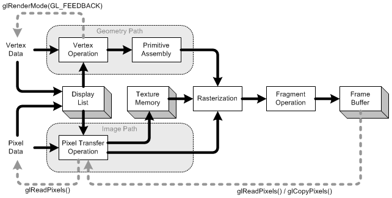

[教程](http://www.songho.ca/opengl/index.html)

# 基础

* glBegin() and glEnd()

    * 可以如下方式绘制一个三角形，这些方法会被立即执行（而不是类似IO缓存模式）

    * 不是所有的方法都可以放在begin和end之间，只有这些才可以：`glVertex*(), glColor*(), glNormal*(), glTexCoord*(), glMaterial*(), glCallList() ,...`

    ```C
    glBegin(GL_TRIANGLES);
        glColor3f(1, 0, 0);     // set vertex color to red
        glVertex3fv(v1);        // draw a triangle with v1, v2, v3
        glVertex3fv(v2);
        glVertex3fv(v3);
    glEnd();
    ```

* glFlush() & glFinish()

    * 大部分GL指令不是立即执行的，有类似于IO的缓存机制，会把这些指令（包括network buffers和graphics accelerator？）先缓存，等到指令缓存满了后才执行。

    * 可以通过`glFlush`立即刷新缓冲区，使缓存的指令立即被执行，但这个调用会立即返回，不会阻塞等所有指令执行完才返回.

    * `glFinish`作用和flush类似，唯一的差别它会阻塞调用，直到之前的所有指令被执行完成

# 图形管线



* 有两条路径，分别处理顶点数据和像素数据，最后都可以写到frame buffer
    
* `Display List`，是一组稍后会被执行的GL命令（被存储、编译）
    
    * list中可以存储各种数据，比如顶点数据、像素数据

    * list存储在gl server端

    * list通过缓存指令和数据的机制以提升性能（和IO缓存类似？），尤其当应用程序运行在网络上时更明显

    * 更多参见[Display List](http://www.songho.ca/opengl/gl_displaylist.html)

* 几何（图形）路径

    * `Vertex Operation`, 至少包含如下操作：

        * 坐标系转换：将顶点、法线坐标通过GL_MODELVIEW矩阵转换，更多参见[Transformation](http://www.songho.ca/opengl/gl_transform.html)

        * 若启用光照，对每个顶点的光照计算将使用转换后的顶点和法线数据
            * 光照计算将会更新顶点颜色

    * `Primitive Assembly`

        * 经过顶点处理后，图元需要通过投影矩阵（projection matrix）再次转换

        * 然后透过裁剪平面（viewing volume clipping planes）的裁剪（从眼睛坐标到裁剪坐标（clip coordinates））

        * 然后通过w进行透视划分，并应用视口变换，以便将3D场景映射到窗口空间坐标。（perspective division by w occurs and viewport transform is applied in order to map 3D scene to window space coordinates.）

        * 最后，如果启用剔除，将会剔除测试

* 像素（图像）路径

    * `Pixel Transfer Operation`
        
        * 像素从client的内存到server，（对于server）一般叫做read或者unpacked

        * 然后会对像素数据：缩放，偏置，映射和夹紧（scaling, bias, mapping and clamping）

        * 转换后的数据要么存储到texture memory中，要么直接送入光栅化器中
    
    * `Texture Memory`，存储texture图像，可用于几何对象的贴图

* `Raterization`

    * 栅格化是将几何数据和像素数据转换为fragment

    * fragments是一个矩形数组（？），包含颜色、深度、线宽、点大小和抗锯齿计算（GL_POINT_SMOOTH, GL_LINE_SMOOTH, GL_POLYGON_SMOOTH）

    * 如果阴影模式（shading mode）是GL_FILL，那么多边形的内部像素(area)将被填充。

    * **每个fragment对应frame buffer中的一个像素**

* `Fragment Operation`： 将fragments转换为frame buffer中的像素

    * 第一步，生成纹素（texel）：从texture memory生成纹理元素，并用于每个fragment

    * 然后雾计算

    * 然后逐片段测试：（裁剪）Scissor Test ⇒ Alpha Test ⇒ （模板）Stencil Test ⇒ Depth Test.

    * 最后进行混合（blending）、抖动（dithering）、逻辑运算和masking by bitmask，并将实际像素数据存储到frame buffer

* `Feedback`

    * 通过`glGet*`和`glIsEnabled`接口，client可以获取大部分的状态和信息

    * 还可以通过`glReadPixels`从frame buffer读取一个矩形区域的像素数据（到client memory或者server的前端buffer）

        * `glCopyPixels`不能将数据返回到client，只是从一个frame buffer到另外一个

    * `glRenderMode(GL_FEEDBACK)`可以获取全部转换后的顶点数据