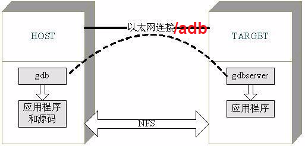

# 简介

* GDB远程调试模型



# 步骤

1. 准备工作

    * 编译带符号的程序/动态库
        * 没有符号的动态库无法打断点，但能在崩溃时挂住，并获取函数名
        * 注：**调试用的带符号的动态库版本须和Target一致**

    * 如果是调试android
        * 对于android应用，须获取**目标android设备**上的`/system/bin/app_process`
        * 获取与目标设备匹配的系统运行时库，比如`/system/lib64`，具体说明参见<附录.1>

2. Target启动gdbserver

    * 启动需要调试的程序/应用

    * 将对应的gdbserver部署到target上
        * gdbserver可以源码编译；
        * android的server还可以从NDK中找到：`ndk/prebuilt/android-arm64/gdbserver`
        * 也可以从固件源码中找到：`<android-source>/prebuilts/misc/android-arm/gdbserver`
        * 一般android设备上会集成gdbserver，无须手动部署；如果手动部署，需要有root权限，具体操作参见<附录.2>

    * 启动gdbserver监听远程连接，`gdbserver :<local_listen_port> --attach  <process_id>`，例如
        ```
        su
        gdbserver64 :6000 --attach `ps -fe |grep tsx200|grep -v grep|busybox awk '{print $2}'`
        ```

3. Host

    * 将之前准备的带符号的动态库、系统库等部署到host上
    
    * 编写gdb调试初始化脚本`gdb.info`，内容大致如下:
        ```
        set sysroot ./symbols/
        set solib-search-path ./so/
        set substitute-path /builds/multimedia/Avalon /home/tuyj/workspace/avalon-ep-dev

        target remote 10.1.126.7:6000

        set breakpoint pending on

        b JniEndpoint3::onNotifyRegisterStatus

        c
        ```

    * 启动gdb(client)，如果是android程序调试，需要使用ndk中的gdb，而不是通用的gdb，命令类似：
        `<ndk>/android-ndk-r17b/prebuilt/linux-x86_64/bin/gdb -x ./gdb.info  ./app_process64`

    * 如果是android调试，还可以通过adb连接gdb server，而不是网络，具体参见<附录.3>


# 附录

## 1. 获取android设备的运行时库

* gdb client调试时，可以通过gdbserver自动从target上拉取，但是大量动态通过网络传输，加载慢，且每次调试都需要重复网络加载

* 所以根据gdb中`info sharedlibrary`所示信息，手动从设备上将这些系统库保存到host上，加速每次加载，但这些设备上的库是没有调试信息的，仅用于解析调试栈

* 可以从android固件编译的服务器上获取带调试信息的运行库，比如：`<android-source>/out/target/product/vt6093/symbols/system/lib64/`

## 2. android部署gdbserver

```
adb push <ndk>/prebuilt/android-arm64/gdbserver/gdbserver /sdcard/gdbserver64
adb shell
    cd /sdcard/
    su
    mount -o remount rw /system    # 更改system为可写
    cp gdbserver  /system/bin/
    chmod 777 /system/bin/gdbserver
```

## 3. adb连接gdb server

```
# host上运行如下
adb forward tcp:6000 tcp:6000   # adb将host上所有6000端口的数据重定向到device端的6000端口上

# host的gdb中执行
target remote :6000             # 连接host的6000端口，而不是直接连接gdb server
```